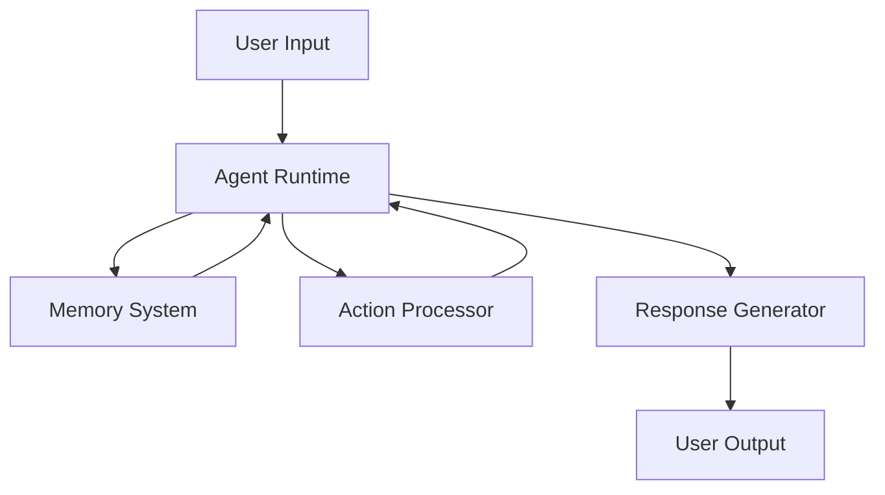

# CLAUDE.md

This file provides guidance to Claude Code (claude.ai/code) when working with code in this
repository.

## Core Understanding

This is a **Fumadocs-based documentation site** using Next.js. Key principles:

- MDX files in `/docs` → Static pages via dynamic routing
- Fumadocs handles navigation, search, and UI components
- Build-time processing enables advanced features
- Everything is file-based and statically generated

## Essential Commands

```bash
# Development
bun dev              # Start development server
bun run build        # Production build (runs linting + processing)
bun start            # Serve production build

# Code Quality (run these before marking tasks complete)
bun run lint         # Must pass with zero warnings
bun run format       # Auto-fix formatting issues
bun run format:check # Check formatting without fixing (useful for CI)
bun run lint:mdx     # Check MDX content quality
```

## Critical Patterns to Follow

### When Creating/Editing Documentation

**DO:**
- Place MDX files in `/docs` with `.mdx` extension
- Include frontmatter: `title` and `description` (required)
- Use H2 (`##`) as highest heading level in content
- Follow existing URL patterns (check similar pages)
- Format code blocks properly (backticks on separate lines)
- Test changes with `bun dev` before committing

**DON'T:**
- Use H1 (`#`) headers in content (title comes from frontmatter)
- Create files outside `/docs` for documentation content
- Mix code and documentation in the same PR
- Forget to update `meta.json` when adding new pages
- Use inline code blocks (e.g., `` ```bash # comment ``)
- Compress multi-line content into single lines in MDX components

### Code Block Formatting

**❌ WRONG - Inline code blocks:**
```mdx
<Tab value="Testing">
  ```bash # This is wrong - don't put code blocks inline
</Tab>
```

**✅ CORRECT - Properly formatted:**
```mdx
<Tab value="Testing">
  ```bash
  # This is correct - code block on separate lines
  bun test
  bun test --coverage
  ```
</Tab>
```

### MDX Component Usage

**Decision Tree for Components:**

```
Need to highlight important info? → <Callout>
Showing step-by-step process? → <Steps> with <Step>
Multiple ways to do something? → <Tabs> with <Tab>
Linking to multiple related pages? → <Cards> with <Card>
Showing file structure? → <Files>, <Folder>, <File>
Q&A or collapsible content? → <Accordions> with <Accordion>
```

**Component Rules:**

1. Always leave blank lines after opening tags and before closing tags
2. Each `<Step>` must contain an H2 header
3. Don't nest interactive components
4. Components are globally available (no imports needed)

### File Organization Patterns

```
/docs
├── index.mdx                 # ALWAYS: Section overview
├── meta.json                 # ALWAYS: Navigation config
├── getting-started/          # Pattern: verb-noun folders
│   ├── index.mdx            # ALWAYS: Section landing
│   ├── quickstart.mdx       # Pattern: noun for guides
│   └── meta.json            # ALWAYS: Section nav
└── api-reference/           # Pattern: noun-noun folders
    ├── endpoints/           # Pattern: group by type
    └── meta.json
```

**Navigation Rules:**

- `meta.json` defines order: `{"pages": ["quickstart", "installation"]}`
- Hidden pages: prefix with `_` (e.g., `_draft.mdx`)
- Landing pages: always `index.mdx` (not in meta.json)
- Use section dividers in meta.json: `"---Section Name---"`

**Advanced meta.json Example:**
```json
{
  "title": "Getting Started",
  "pages": [
    "---Basics---",
    "overview",
    "quickstart",
    "---Configuration---",
    "installation",
    "configuration",
    "---Next Steps---",
    "tutorials"
  ]
}
```

## Content Patterns (Based on Best Practices)

### Page Types and Their Structure

**1. Quickstart/Tutorial Pages**

Structure your tutorial pages to guide users through a complete workflow:

```mdx
---
title: Build Your First Agent
description: Learn how to create and deploy an AI agent in 5 minutes
keywords: tutorial, quickstart, agent, getting-started
---

Learn how to build your first ElizaOS agent with this step-by-step guide.

## What you'll build

In this tutorial, you'll create an agent that can:
- Respond to user messages
- Remember conversation context
- Execute custom actions

<Callout type="info">
This tutorial takes approximately 10 minutes to complete.
</Callout>

## Prerequisites

Before starting, ensure you have:

| Requirement | Version | Check Command |
|------------|---------|---------------|
| Node.js | 20+ | `node --version` |
| Bun | 1.0+ | `bun --version` |
| Git | Any | `git --version` |

## Build your agent

<Steps>

<Step>
## Install ElizaOS

First, install the ElizaOS CLI globally:

```bash
bun install -g @elizaos/cli
```

Verify the installation:

```bash
elizaos --version
```
</Step>

<Step>
## Create your project

Create a new agent project:

```bash
elizaos create my-first-agent
cd my-first-agent
```

This creates a project with the following structure:

<Files>
  <Folder name="my-first-agent" defaultOpen>
    <File name="character.json" />
    <File name="package.json" />
    <File name=".env.example" />
  </Folder>
</Files>
</Step>

<Step>
## Configure your agent

Edit `character.json` to define your agent's personality:

```json title="character.json"
{
  "name": "Assistant",
  "description": "A helpful AI assistant",
  "personality": "friendly and knowledgeable"
}
```
</Step>

</Steps>

## Next steps

Now that you've created your first agent:

<Cards>
  <Card 
    title="Add Custom Actions" 
    description="Learn how to extend your agent with custom actions"
    href="/guides/custom-actions"
  />
  <Card 
    title="Deploy Your Agent" 
    description="Deploy your agent to production"
    href="/guides/deployment"
  />
</Cards>
```

**2. Concept/Explanation Pages**

For conceptual documentation, use this pattern:

```mdx
---
title: Understanding Agents
description: Core concepts of agents in ElizaOS
keywords: agents, architecture, concepts
---

Agents are the fundamental building blocks of ElizaOS applications.

## What is an agent?

An agent is an autonomous AI entity that can:
- Process natural language
- Maintain conversation state
- Execute actions
- Learn from interactions

<Callout type="lightbulb">
Think of agents as AI-powered team members that can handle specific tasks autonomously.
</Callout>

## Core concepts

### Agent lifecycle

Agents go through several lifecycle stages:

| Stage | Description | Triggered By |
|-------|-------------|--------------|
| **Initialization** | Agent loads configuration | System startup |
| **Active** | Agent processes messages | User interaction |
| **Idle** | Agent waits for input | No activity |
| **Shutdown** | Agent saves state | System shutdown |

### Agent vs. Traditional Bots

Understanding the key differences:

<Tabs>
  <Tab value="agents">
    **AI Agents**
    - Contextual understanding
    - Dynamic responses
    - Learning capabilities
    - Multi-step reasoning
  </Tab>
  <Tab value="bots">
    **Traditional Bots**
    - Rule-based responses
    - Static workflows
    - No learning
    - Single-step logic
  </Tab>
</Tabs>

## Architecture overview



## Common patterns

### Stateful conversations

Agents maintain conversation state across interactions:

```typescript title="examples/stateful-agent.ts"
const agent = new Agent({
  name: "MemoryBot",
  plugins: [memoryPlugin],
  // Agent remembers context
  contextWindow: 10
});
```

### Action chains

Agents can execute complex action sequences:

```typescript title="examples/action-chains.ts"
agent.registerAction({
  name: "processOrder",
  steps: [
    "validateInput",
    "checkInventory", 
    "createOrder",
    "sendConfirmation"
  ]
});
```

## Best practices

<Callout type="warning">
Always validate agent responses in production environments.
</Callout>

1. **Keep agents focused** - One agent per domain
2. **Use appropriate models** - Match model to task complexity
3. **Monitor performance** - Track response times and accuracy
4. **Test edge cases** - Ensure graceful failure handling

## Related topics

- [Creating Custom Agents](/guides/custom-agents)
- [Agent Memory Systems](/concepts/memory)
- [Action Development](/guides/actions)
```

**3. API Reference Pages**

For API documentation, use this structure:

```mdx
---
title: Agent API Reference
description: Complete API reference for the Agent class
keywords: api, reference, agent, documentation
---

Complete reference for the ElizaOS Agent API.

## Installation

<Tabs>
  <Tab value="npm">
    ```bash
    npm install @elizaos/core
    ```
  </Tab>
  <Tab value="bun">
    ```bash
    bun add @elizaos/core
    ```
  </Tab>
</Tabs>

## Quick start

```typescript title="examples/basic-agent.ts"
import { Agent } from '@elizaos/core';

const agent = new Agent({
  name: 'MyAgent',
  model: 'gpt-4'
});

await agent.start();
```

## Constructor

### `new Agent(config)`

Creates a new agent instance.

#### Parameters

| Parameter | Type | Required | Default | Description |
|-----------|------|----------|---------|-------------|
| `config` | `AgentConfig` | Yes | - | Agent configuration object |
| `config.name` | `string` | Yes | - | Unique agent identifier |
| `config.model` | `string` | No | `'gpt-3.5-turbo'` | LLM model to use |
| `config.temperature` | `number` | No | `0.7` | Response randomness (0-1) |
| `config.plugins` | `Plugin[]` | No | `[]` | Agent plugins |

#### Returns

Returns an `Agent` instance.

#### Example

```typescript
const agent = new Agent({
  name: 'SupportBot',
  model: 'gpt-4',
  temperature: 0.5,
  plugins: [memoryPlugin, actionPlugin]
});
```

## Methods

### `start()`

Starts the agent runtime.

```typescript
await agent.start();
```

<Callout type="info">
The agent must be started before processing messages.
</Callout>

### `processMessage(message, context?)`

Processes a user message and returns a response.

#### Parameters

| Parameter | Type | Required | Description |
|-----------|------|----------|-------------|
| `message` | `string` | Yes | User input message |
| `context` | `Context` | No | Optional conversation context |

#### Returns

```typescript
Promise<{
  text: string;
  actions?: Action[];
  metadata?: Record<string, any>;
}>
```

#### Example

```typescript
const response = await agent.processMessage(
  "What's the weather?",
  { userId: "user123" }
);

console.log(response.text);
// "I'll check the weather for you."
```

### `registerAction(action)`

Registers a custom action with the agent.

<Tabs>
  <Tab value="simple">
    ```typescript
    agent.registerAction({
      name: 'getWeather',
      handler: async (params) => {
        const weather = await fetchWeather(params.location);
        return weather;
      }
    });
    ```
  </Tab>
  <Tab value="advanced">
    ```typescript
    agent.registerAction({
      name: 'getWeather',
      description: 'Fetches current weather',
      parameters: {
        location: {
          type: 'string',
          required: true,
          description: 'City name or coordinates'
        }
      },
      handler: async (params) => {
        // Implementation
      }
    });
    ```
  </Tab>
</Tabs>

## Events

The Agent class extends EventEmitter and emits the following events:

| Event | Payload | Description |
|-------|---------|-------------|
| `message` | `{text: string, userId: string}` | New message received |
| `response` | `{text: string, actions: Action[]}` | Response generated |
| `error` | `Error` | Error occurred |
| `action` | `{name: string, result: any}` | Action executed |

### Event example

```typescript
agent.on('message', (payload) => {
  console.log(`User ${payload.userId}: ${payload.text}`);
});

agent.on('error', (error) => {
  console.error('Agent error:', error);
});
```

## Types

### `AgentConfig`

```typescript
interface AgentConfig {
  name: string;
  model?: string;
  temperature?: number;
  maxTokens?: number;
  plugins?: Plugin[];
  memory?: MemoryConfig;
  actions?: Action[];
}
```

### `Context`

```typescript
interface Context {
  userId?: string;
  sessionId?: string;
  metadata?: Record<string, any>;
}
```

## Error handling

<Callout type="warning">
Always wrap agent operations in try-catch blocks in production.
</Callout>

```typescript
try {
  const response = await agent.processMessage(message);
} catch (error) {
  if (error.code === 'RATE_LIMIT') {
    // Handle rate limiting
  } else if (error.code === 'INVALID_INPUT') {
    // Handle validation errors
  } else {
    // Handle other errors
  }
}
```

## See also

- [Agent Configuration Guide](/guides/agent-configuration)
- [Plugin Development](/guides/plugin-development)
- [Memory Systems](/concepts/memory)
```

### Content Guidelines

**When writing any documentation:**

1. **Start with value** - What will the user achieve?
2. **Show prerequisites clearly** - Use tables for requirements
3. **Use progressive disclosure** - Simple → Complex
4. **Provide complete examples** - Full, runnable code
5. **Guide next steps** - Link to related content

**Callout Usage:**
- `<Callout type="info">` - General information, tips
- `<Callout type="warning">` - Important warnings, gotchas
- `<Callout type="success">` - Success confirmations
- `<Callout type="lightbulb">` - Best practices, pro tips

**Code Block Best Practices:**
- Always include `title` attribute with filename
- Use appropriate language identifier
- Add comments for complex parts
- Show full context (imports, exports)

## Text Formatting Standards

### Inline Formatting Quick Reference

- **Bold**: UI elements, important terms → `**Save button**`
- _Italics_: New concepts, emphasis → `*rarely* need this`
- `Code`: Commands, filenames, values → `` `bun dev` ``
- Links: Descriptive text → `[see configuration guide](/guides/config)`

### Code Blocks

```typescript title="app/config.ts"  // Always add filename
export const config = {
  // Code here
};
```

For package installation:

```package-install
fumadocs-ui fumadocs-core
```

## Architecture Decisions

### Why These Patterns Matter

1. **Static Generation**: Pre-building ensures fast loads and SEO
2. **File-based Routing**: Predictable URLs from file structure
3. **MDX Processing**: Enables rich content with components
4. **Fumadocs Conventions**: Following them ensures features work

### Extension Points

When adding capabilities, check these locations:

- `/scripts/*` - Build-time processing examples
- `/app/api/*` - Runtime features and endpoints
- `source.config.ts` - MDX processing configuration
- `package.json` scripts - Build pipeline hooks

Common patterns for new features:

- **Search Enhancement**: Process content → Build index → Serve via API
- **Analytics**: Add tracking → Collect events → Display insights
- **LLM Formats**: Parse MDX → Strip formatting → Serve as `/llms.txt`
- **API Docs**: Parse OpenAPI → Generate MDX → Include in build

## Development Checklist

Before completing any documentation task:

- [ ] All MDX files have required frontmatter
- [ ] Navigation updated in relevant `meta.json` files
- [ ] No H1 headers used in content
- [ ] All internal links use absolute paths without `/docs`
- [ ] Ran `bun run lint:mdx` and fixed any issues
- [ ] Tested locally with `bun dev`
- [ ] Ran `bun run build` successfully (must pass before committing)
- [ ] Verified navigation and search work correctly

## Quick Decisions Guide

**"Where should I put this new page?"** → Follow existing patterns, check similar content's location

**"What component should I use?"** → See Decision Tree in Critical Patterns section

**"How should I format this?"** → Check similar pages, follow their patterns

**"Should I create a new folder?"** → Only if you have 3+ related pages to group

**"What frontmatter fields do I need?"** → `title` and `description` are required, others optional

## Tools and Helpers

### Context7 MCP Server

Enable for real-time Fumadocs documentation access:

- Provides current component APIs
- Shows configuration examples
- Explains advanced patterns
- Use when: implementing new Fumadocs features

### Build Tools

```bash
# Optional advanced features
bun run build:openapi    # Generate API docs from OpenAPI specs
# Add custom scripts in /scripts for new capabilities
```

## Remember

1. **Follow existing patterns** - consistency matters more than perfection
2. **Test everything locally** - `bun dev` before pushing
3. **Keep it simple** - use built-in components before custom solutions
4. **Document as you code** - update docs with feature changes
5. **Ask when uncertain** - check existing examples first
