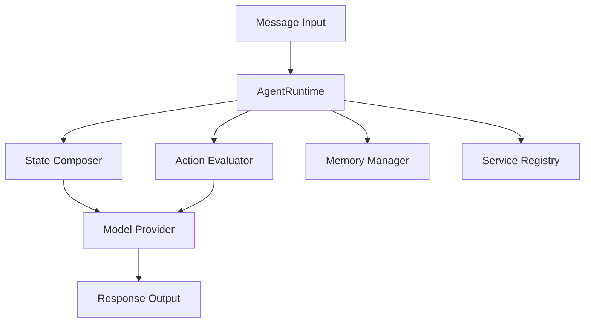

# CLAUDE.md

This file provides guidance to Claude Code (claude.ai/code) when working with code in this
repository.

## Core Understanding

This is a **Fumadocs-based documentation site** using Next.js. Key principles:

- MDX files in `/docs` → Static pages via dynamic routing
- Fumadocs handles navigation, search, and UI components
- Build-time processing enables advanced features
- Everything is file-based and statically generated

## Essential Commands

```bash
# Development
bun dev              # Start development server
bun run build        # Production build (runs linting + processing)
bun start            # Serve production build

# Code Quality (run these before marking tasks complete)
bun run lint         # Must pass with zero warnings
bun run format       # Auto-fix formatting issues
bun run format:check # Check formatting without fixing (useful for CI)
bun run lint:mdx     # Check MDX content quality
```

## Critical Patterns to Follow

### When Creating/Editing Documentation

**DO:**
- Place MDX files in `/docs` with `.mdx` extension
- Include frontmatter: `title` and `description` (required)
- Use H2 (`##`) as highest heading level in content
- Follow existing URL patterns (check similar pages)
- Format code blocks properly (backticks on separate lines)
- Test changes with `bun dev` before committing

**DON'T:**
- Use H1 (`#`) headers in content (title comes from frontmatter)
- Create files outside `/docs` for documentation content
- Mix code and documentation in the same PR
- Forget to update `meta.json` when adding new pages
- Use inline code blocks (e.g., `` ```bash # comment ``)
- Compress multi-line content into single lines in MDX components
- **NO EMOJI EVER in documentation content**

### Code Block Formatting

**❌ WRONG - Inline code blocks:**
```mdx
<Tab value="Testing">
  ```bash # This is wrong - don't put code blocks inline
</Tab>
```

**✅ CORRECT - Properly formatted:**
```mdx
<Tab value="Testing">
  ```bash
  # This is correct - code block on separate lines
  bun test
  bun test --coverage
  ```
</Tab>
```

### MDX Component Usage

**Decision Tree for Components:**

```
Need to highlight important info? → <Callout>
Showing step-by-step process? → <Steps> with <Step>
Multiple ways to do something? → <Tabs> with <Tab>
Linking to multiple related pages? → <Cards> with <Card>
Showing file structure? → <Files>, <Folder>, <File>
Q&A or collapsible content? → <Accordions> with <Accordion>
```

**Component Rules:**

1. Always leave blank lines after opening tags and before closing tags
2. Each `<Step>` must contain an H2 header
3. Don't nest interactive components
4. Components are globally available (no imports needed)

### File Organization Patterns

```
/docs
├── index.mdx                 # ALWAYS: Section overview
├── meta.json                 # ALWAYS: Navigation config
├── getting-started/          # Pattern: verb-noun folders
│   ├── index.mdx            # ALWAYS: Section landing
│   ├── quickstart.mdx       # Pattern: noun for guides
│   └── meta.json            # ALWAYS: Section nav
└── api-reference/           # Pattern: noun-noun folders
    ├── endpoints/           # Pattern: group by type
    └── meta.json
```

**Navigation Rules:**

- `meta.json` defines order: `{"pages": ["quickstart", "installation"]}`
- Hidden pages: prefix with `_` (e.g., `_draft.mdx`)
- Landing pages: always `index.mdx` (not in meta.json)
- Use section dividers in meta.json: `"---Section Name---"`

**Advanced meta.json Example:**
```json
{
  "title": "Getting Started",
  "pages": [
    "---Basics---",
    "overview",
    "quickstart",
    "---Configuration---",
    "installation",
    "configuration",
    "---Next Steps---",
    "tutorials"
  ]
}
```

## Content Patterns (Based on Best Practices)

### Page Types and Their Structure

**1. Quickstart/Tutorial Pages**

Structure your tutorial pages to guide users through a complete workflow:

```mdx
---
title: Build Your First ElizaOS Agent
description: Create an AI agent with memory, actions, and Discord integration in 10 minutes
keywords: tutorial, quickstart, agent, discord, elizaos
---

Learn how to build your first ElizaOS agent with Discord integration.

## What you'll build

In this tutorial, you'll create an agent that can:
- Respond intelligently on Discord
- Remember conversation context
- Execute the REPLY action
- Use OpenAI for responses

<Callout type="info">
This tutorial takes approximately 10 minutes to complete.
</Callout>

## Prerequisites

Before starting, ensure you have:

| Requirement | Version | Check Command |
|------------|---------|---------------|
| Node.js | 20.18+ | `node --version` |
| Bun | 1.1.43+ | `bun --version` |
| Git | Any | `git --version` |
| OpenAI API Key | - | [Get from OpenAI](https://platform.openai.com) |

## Build your agent

<Steps>

<Step>
## Install ElizaOS CLI

First, install the ElizaOS CLI globally:

```bash
bun install -g @elizaos/cli
```

Verify the installation:

```bash
elizaos --version
```
</Step>

<Step>
## Create your project

Create a new ElizaOS agent project:

```bash
elizaos create my-first-agent --type project
cd my-first-agent
```

This creates a project with the following structure:

<Files>
  <Folder name="my-first-agent" defaultOpen>
    <Folder name="characters">
      <File name="example.json" />
    </Folder>
    <File name="package.json" />
    <File name=".env.example" />
    <File name=".gitignore" />
  </Folder>
</Files>
</Step>

<Step>
## Configure environment

Copy the example environment file and add your keys:

```bash
cp .env.example .env
```

Edit `.env` with your API keys:

```bash title=".env"
# Core Database
DATABASE_URL=postgresql://localhost/elizaos

# OpenAI Configuration
OPENAI_API_KEY=sk-your-openai-key

# Discord Configuration
DISCORD_BOT_TOKEN=your-discord-token
DISCORD_APPLICATION_ID=your-app-id
```
</Step>

<Step>
## Create your character

Create a new character file:

```json title="characters/my-agent.json"
{
  "name": "Ada",
  "bio": [
    "Ada is a helpful AI assistant built with ElizaOS.",
    "She specializes in answering questions and helping users."
  ],
  "plugins": [
    "@elizaos/plugin-sql",      // Required first
    "@elizaos/plugin-openai",   // AI provider
    "@elizaos/plugin-discord",  // Discord integration
    "@elizaos/plugin-bootstrap" // Required last
  ],
  "settings": {
    "model": "gpt-4",
    "temperature": 0.7,
    "maxTokens": 2000
  },
  "messageExamples": [
    [
      {
        "name": "{{user1}}",
        "content": { "text": "What can you help me with?" }
      },
      {
        "name": "Ada",
        "content": {
          "text": "I can help you with a variety of tasks! I'm here to answer questions, provide information, and assist with anything you need.",
          "providers": ["KNOWLEDGE"]
        }
      }
    ]
  ]
}
```
</Step>

<Step>
## Start your agent

Run your agent in development mode:

```bash
elizaos dev --character characters/my-agent.json
```

Your agent is now running and connected to Discord!
</Step>

</Steps>

## Next steps

Now that you've created your first agent:

<Cards>
  <Card
    title="Add Custom Actions"
    description="Learn how to create custom actions for your agent"
    href="/advanced/custom-actions"
  />
  <Card
    title="Deploy to Production"
    description="Deploy your agent using Docker or cloud services"
    href="/advanced/deployment"
  />
  <Card
    title="Add More Plugins"
    description="Integrate Twitter, Telegram, and blockchain"
    href="/plugins"
  />
</Cards>
```

**2. Concept/Explanation Pages**

For conceptual documentation, use this pattern:

```mdx
---
title: Understanding AgentRuntime in ElizaOS
description: Core concepts of the AgentRuntime orchestration system
keywords: agent, runtime, orchestration, elizaos
---

AgentRuntime is the central orchestration system that powers ElizaOS agents.

## What is AgentRuntime?

AgentRuntime is the core class that:
- Orchestrates all agent operations
- Manages plugins and services
- Handles memory and state
- Processes messages through actions

<Callout type="lightbulb">
Think of AgentRuntime as the brain of your agent - it coordinates all components to create intelligent behavior.
</Callout>

## Core concepts

### Runtime lifecycle

The AgentRuntime goes through several lifecycle stages:

| Stage | Description | Key Methods |
|-------|-------------|-------------|
| **Initialization** | Load character and plugins | `runtime.initialize()` |
| **Registration** | Register services and actions | `runtime.registerService()` |
| **Active** | Process messages and events | `runtime.processActions()` |
| **Shutdown** | Clean up resources | `runtime.stop()` |

### Runtime vs. Character

Understanding the separation of concerns:

<Tabs>
  <Tab value="runtime">
    **AgentRuntime**
    - Execution engine
    - Service management
    - Memory operations
    - Plugin coordination
    - State composition
  </Tab>
  <Tab value="character">
    **Character**
    - Personality definition
    - Response style
    - Knowledge base
    - Example messages
    - Settings & secrets
  </Tab>
</Tabs>

## Architecture overview



## Common patterns

### Accessing services

Use typed service access for type safety:

```typescript title="examples/service-access.ts"
// Get a typed service instance
const twitterService = runtime.getTypedService<TwitterService>('twitter');

// Use the service
await twitterService.postTweet({
  text: "Hello from ElizaOS!",
  mediaIds: []
});
```

### State composition

Compose runtime state for context:

```typescript title="examples/state-composition.ts"
// Compose state with specific components
const state = await runtime.composeState(message, {
  useRecentMessages: true,
  useKnowledge: true,
  useMemories: true
});

// Access composed data
console.log(state.recentMessages);
console.log(state.relevantKnowledge);
```

### Memory operations

Work with the memory system:

```typescript title="examples/memory-operations.ts"
// Create a memory
await runtime.createMemory({
  content: "User prefers technical explanations",
  entityId: message.userId,
  type: "preference"
});

// Search memories
const memories = await runtime.searchMemories({
  tableName: "memories",
  query: "technical preferences",
  limit: 10
});
```

## Plugin architecture

```typescript title="examples/plugin-structure.ts"
const myPlugin: Plugin = {
  name: "my-plugin",
  description: "Custom functionality",
  actions: [replyAction, analyzeAction],
  providers: [knowledgeProvider],
  services: [backgroundService],
  evaluators: [sentimentEvaluator]
};

// Register during initialization
runtime.registerPlugin(myPlugin);
```

## Best practices

<Callout type="warning">
Always ensure plugin-sql is loaded first and plugin-bootstrap is loaded last.
</Callout>

1. **Initialize properly** - Wait for async initialization
2. **Type your services** - Use TypeScript generics
3. **Handle errors** - Runtime operations can fail
4. **Clean shutdown** - Always call `runtime.stop()`

## Related topics

- [Character Configuration](/core-concepts/character)
- [Action Development](/advanced/custom-actions)
- [Memory Systems](/core-concepts/memory)
- [Plugin Development](/plugins/creating-plugins)
```

**3. API Reference Pages**

For API documentation, use this structure:

```mdx
---
title: AgentRuntime API Reference
description: Complete API reference for the AgentRuntime class
keywords: api, reference, runtime, elizaos
---

Complete reference for the ElizaOS AgentRuntime API.

## Installation

<Tabs>
  <Tab value="npm">
    ```bash
    npm install @elizaos/core
    ```
  </Tab>
  <Tab value="bun">
    ```bash
    bun add @elizaos/core
    ```
  </Tab>
</Tabs>

## Quick start

```typescript title="examples/basic-runtime.ts"
import { AgentRuntime } from '@elizaos/core';

const runtime = new AgentRuntime({
  token: 'your-agent-token',
  character: characterData,
  plugins: [
    "@elizaos/plugin-sql",
    "@elizaos/plugin-openai",
    "@elizaos/plugin-bootstrap"
  ]
});

await runtime.initialize();
```

## Constructor

### `new AgentRuntime(config)`

Creates a new AgentRuntime instance.

#### Parameters

| Parameter | Type | Required | Default | Description |
|-----------|------|----------|---------|-------------|
| `config.token` | `string` | Yes | - | Unique agent identifier |
| `config.character` | `Character` | Yes | - | Agent character definition |
| `config.plugins` | `Plugin[]` | No | `[]` | Runtime plugins to load |
| `config.services` | `Service[]` | No | `[]` | Services to register |
| `config.providers` | `Provider[]` | No | `[]` | Context providers |

#### Returns

Returns an `AgentRuntime` instance.

#### Example

```typescript
const runtime = new AgentRuntime({
  token: crypto.randomUUID(),
  character: {
    name: "Ada",
    bio: ["AI researcher and assistant"],
    plugins: ["@elizaos/plugin-sql", "@elizaos/plugin-openai", "@elizaos/plugin-bootstrap"]
  }
});
```

## Core Methods

### `initialize()`

Initializes the runtime and all plugins.

```typescript
await runtime.initialize();
```

<Callout type="info">
Must be called before using any runtime features.
</Callout>

### `processActions(message, responses)`

Processes a message through all registered actions.

#### Parameters

| Parameter | Type | Required | Description |
|-----------|------|----------|-------------|
| `message` | `Memory` | Yes | Input message to process |
| `responses` | `Memory[]` | Yes | Array to collect responses |

#### Returns

```typescript
Promise<void>
```

#### Example

```typescript
const message = {
  content: { text: "What's the weather?" },
  userId: "user123",
  roomId: "room456"
};

const responses: Memory[] = [];
await runtime.processActions(message, responses);
```

### `composeState(message, options?)`

Composes the current runtime state.

#### Parameters

| Parameter | Type | Required | Description |
|-----------|------|----------|-------------|
| `message` | `Memory` | Yes | Current message context |
| `options.useRecentMessages` | `boolean` | No | Include recent messages |
| `options.useKnowledge` | `boolean` | No | Include knowledge base |
| `options.useMemories` | `boolean` | No | Include relevant memories |

#### Returns

```typescript
Promise<State>
```

#### Example

```typescript
const state = await runtime.composeState(message, {
  useRecentMessages: true,
  useKnowledge: true,
  useMemories: true
});

console.log(state.recentMessages);
console.log(state.relevantKnowledge);
```

## Service Management

### `registerService(serviceDef)`

Registers a new service with the runtime.

<Tabs>
  <Tab value="basic">
    ```typescript
    runtime.registerService({
      service: new TwitterService(),
      serviceType: 'twitter'
    });
    ```
  </Tab>
  <Tab value="typed">
    ```typescript
    class CustomService extends Service {
      static serviceType = 'custom';

      async start() {
        // Initialize service
      }
    }

    runtime.registerService({
      service: new CustomService(),
      serviceType: CustomService.serviceType
    });
    ```
  </Tab>
</Tabs>

### `getTypedService<T>(serviceType)`

Gets a typed service instance.

```typescript
const twitter = runtime.getTypedService<TwitterService>('twitter');
await twitter.postTweet({ text: "Hello world!" });
```

## Memory Operations

### `createMemory(memory, tableName?, unique?)`

Creates a new memory entry.

#### Parameters

| Parameter | Type | Required | Default | Description |
|-----------|------|----------|---------|-------------|
| `memory` | `Memory` | Yes | - | Memory object to store |
| `tableName` | `string` | No | `'memories'` | Target table |
| `unique` | `boolean` | No | `false` | Prevent duplicates |

#### Example

```typescript
await runtime.createMemory({
  content: { text: "User likes TypeScript" },
  entityId: message.userId,
  type: "preference"
}, "preferences", true);
```

### `searchMemories(params)`

Searches memories using semantic search.

```typescript
const memories = await runtime.searchMemories({
  tableName: "memories",
  query: "programming preferences",
  match_count: 10,
  unique: true
});
```

## Plugin Management

### `registerPlugin(plugin)`

Registers a plugin with the runtime.

```typescript
const customPlugin: Plugin = {
  name: "custom-plugin",
  actions: [customAction],
  providers: [customProvider],
  services: [customService]
};

runtime.registerPlugin(customPlugin);
```

## Events

### `emitEvent(eventName, data)`

Emits a custom event.

```typescript
runtime.emitEvent('agent:thinking', {
  message: "Processing request...",
  timestamp: Date.now()
});
```

### `registerEvent(eventDef)`

Registers a custom event handler.

```typescript
runtime.registerEvent({
  name: 'agent:thinking',
  handler: async (data) => {
    console.log('Agent is thinking:', data.message);
  }
});
```

## Model Operations

### `useModel(modelType, params)`

Uses a model for completion or embedding.

```typescript
// Text completion
const completion = await runtime.useModel(ModelType.COMPLETION, {
  prompt: "Translate to Spanish: Hello",
  temperature: 0.7,
  max_tokens: 100
});

// Generate embedding
const embedding = await runtime.useModel(ModelType.TEXT_EMBEDDING, {
  text: "ElizaOS is amazing"
});
```

## Types

### `Character`

```typescript
interface Character {
  name: string;
  bio: string[];
  messageExamples: Array<[Message, Message]>;
  postExamples?: string[];
  topics?: string[];
  adjectives?: string[];
  knowledge?: string[];
  plugins: string[];
  settings?: {
    model?: string;
    temperature?: number;
    maxTokens?: number;
  };
  secrets?: Record<string, string>;
}
```

### `Memory`

```typescript
interface Memory {
  id?: string;
  content: {
    text: string;
    [key: string]: any;
  };
  entityId?: string;
  roomId?: string;
  worldId?: string;
  embedding?: number[];
  createdAt?: number;
}
```

### `State`

```typescript
interface State {
  values: Record<string, any>;
  data?: any;
  text?: string;
  recentMessages?: Memory[];
  relevantKnowledge?: string[];
  relevantMemories?: Memory[];
}
```

## Error handling

<Callout type="warning">
Always handle async operations and potential service failures.
</Callout>

```typescript
try {
  await runtime.initialize();
  const service = runtime.getTypedService<TwitterService>('twitter');
  await service.postTweet({ text: "Hello!" });
} catch (error) {
  if (error.message.includes('not registered')) {
    console.error('Service not found');
  } else if (error.code === 'RATE_LIMIT') {
    console.error('Rate limited');
  } else {
    console.error('Unexpected error:', error);
  }
}
```

## See also

- [Character Configuration](/core-concepts/character)
- [Action Development](/advanced/custom-actions)
- [Plugin Architecture](/plugins)
- [Memory Systems](/core-concepts/memory)
```

### Content Guidelines

**When writing any documentation:**

1. **Start with value** - What will the user achieve?
2. **Show prerequisites clearly** - Use tables for requirements
3. **Use progressive disclosure** - Simple → Complex
4. **Provide complete examples** - Full, runnable code
5. **Guide next steps** - Link to related content

**Callout Usage:**
- `<Callout type="info">` - General information, tips
- `<Callout type="warning">` - Important warnings, gotchas
- `<Callout type="success">` - Success confirmations
- `<Callout type="lightbulb">` - Best practices, pro tips

**Code Block Best Practices:**
- Always include `title` attribute with filename
- Use appropriate language identifier
- Add comments for complex parts
- Show full context (imports, exports)

## Text Formatting Standards

### Inline Formatting Quick Reference

- **Bold**: UI elements, important terms → `**Save button**`
- _Italics_: New concepts, emphasis → `*rarely* need this`
- `Code`: Commands, filenames, values → `` `bun dev` ``
- Links: Descriptive text → `[see configuration guide](/guides/config)`

### Code Blocks

```typescript title="app/config.ts"  // Always add filename
export const config = {
  // Code here
};
```

For package installation:

```package-install
fumadocs-ui fumadocs-core
```

## Architecture Decisions

### Why These Patterns Matter

1. **Static Generation**: Pre-building ensures fast loads and SEO
2. **File-based Routing**: Predictable URLs from file structure
3. **MDX Processing**: Enables rich content with components
4. **Fumadocs Conventions**: Following them ensures features work

### Extension Points

When adding capabilities, check these locations:

- `/scripts/*` - Build-time processing examples
- `/app/api/*` - Runtime features and endpoints
- `source.config.ts` - MDX processing configuration
- `package.json` scripts - Build pipeline hooks

Common patterns for new features:

- **Search Enhancement**: Process content → Build index → Serve via API
- **Analytics**: Add tracking → Collect events → Display insights
- **LLM Formats**: Parse MDX → Strip formatting → Serve as `/llms.txt`
- **API Docs**: Parse OpenAPI → Generate MDX → Include in build

## Development Checklist

Before completing any documentation task:

- [ ] All MDX files have required frontmatter
- [ ] Navigation updated in relevant `meta.json` files
- [ ] No H1 headers used in content
- [ ] All internal links use absolute paths without `/docs`
- [ ] Ran `bun run lint:mdx` and fixed any issues
- [ ] Tested locally with `bun dev`
- [ ] Ran `bun run build` successfully (must pass before committing)
- [ ] Verified navigation and search work correctly

## Quick Decisions Guide

**"Where should I put this new page?"** → Follow existing patterns, check similar content's location

**"What component should I use?"** → See Decision Tree in Critical Patterns section

**"How should I format this?"** → Check similar pages, follow their patterns

**"Should I create a new folder?"** → Only if you have 3+ related pages to group

**"What frontmatter fields do I need?"** → `title` and `description` are required, others optional

## Tools and Helpers

### Context7 MCP Server

Enable for real-time Fumadocs documentation access:

- Provides current component APIs
- Shows configuration examples
- Explains advanced patterns
- Use when: implementing new Fumadocs features

### Build Tools

```bash
# Optional advanced features
bun run build:openapi    # Generate API docs from OpenAPI specs
# Add custom scripts in /scripts for new capabilities
```

## Remember

1. **Follow existing patterns** - consistency matters more than perfection
2. **Test everything locally** - `bun dev` before pushing
3. **Keep it simple** - use built-in components before custom solutions
4. **Document as you code** - update docs with feature changes
5. **Ask when uncertain** - check existing examples first
