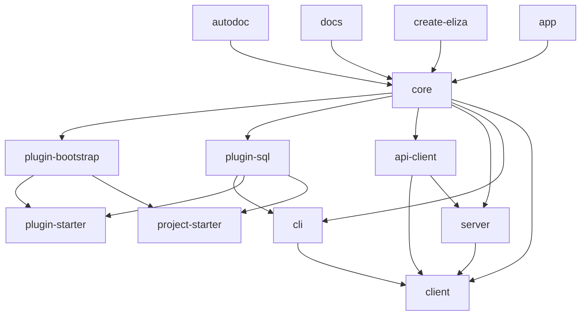

# Package Organization

elizaOS is organized into 15 core packages within a monorepo structure. Each package serves a specific purpose and follows consistent patterns for dependency management, API design, and extensibility.

## Package Hierarchy

### Core Foundation

```
@elizaos/core
├── Types and interfaces
├── Agent runtime
├── Plugin system
├── Service management
└── Utilities
```

### Application Layer

```
@elizaos/cli                    # Command-line interface
@elizaos/client                 # Web-based management UI
@elizaos/server                 # HTTP server for agent communication
@elizaos/app                    # Desktop application (Tauri)
```

### Data and Infrastructure

```
@elizaos/plugin-sql             # Database adapter and migrations
@elizaos/plugin-bootstrap       # Essential actions, evaluators, providers
@elizaos/api-client             # HTTP client for API communication
```

### Development Tools

```
@elizaos/autodoc                # Automatic documentation generation
@elizaos/docs                   # Documentation website
@elizaos/create-eliza           # Project bootstrapping tool
```

### Templates and Starters

```
@elizaos/plugin-starter         # Plugin development template
@elizaos/project-starter        # Basic project template
@elizaos/project-tee-starter    # TEE (Trusted Execution Environment) template
@elizaos/plugin-dummy-services  # Mock services for testing
```

## Core Packages

### `@elizaos/core`

The foundation package containing all essential types, interfaces, and utilities:

**Key Components:**
- **Runtime System**: Agent lifecycle management
- **Type Definitions**: TypeScript interfaces and types
- **Entity-Component System**: Entity management and relationships
- **Service Framework**: Service registration and dependency injection
- **Plugin Interface**: Plugin definition and loading system

**Dependencies:**
```json
{
  "dependencies": {
    "uuid": "^10.0.0",
    "bun": "^1.2.15"
  }
}
```

**Key Exports:**
```typescript
// Types
export * from './types';

// Runtime
export { AgentRuntime } from './runtime';

// Services
export { createService, defineService } from './services';

// Utilities
export { createLogger, stringToUuid } from './utils';
```

### `@elizaos/cli`

Command-line interface for agent development and management:

**Key Features:**
- **Project Creation**: Bootstrap new agent projects
- **Plugin Management**: Install, update, and manage plugins
- **Development Tools**: Hot reloading and debugging
- **Testing Framework**: Run tests and generate reports

**Commands:**
```bash
elizaos create <project-name>    # Create new project
elizaos start                    # Start agent
elizaos dev                      # Development mode
elizaos test                     # Run tests
elizaos plugin install <name>    # Install plugin
```

**Dependencies:**
```json
{
  "dependencies": {
    "@elizaos/core": "workspace:*",
    "@elizaos/plugin-bootstrap": "workspace:*",
    "@elizaos/plugin-sql": "workspace:*"
  }
}
```

### `@elizaos/client`

React-based web application for agent management:

**Key Features:**
- **Agent Dashboard**: Monitor and control multiple agents
- **Chat Interface**: Direct communication with agents
- **Memory Viewer**: Inspect agent memories and relationships
- **Plugin Management**: Visual plugin configuration
- **Settings Panel**: Environment and configuration management

**Technology Stack:**
- **React 19.1.0**: Modern React with concurrent features
- **TypeScript**: Full type safety
- **Vite**: Fast build tooling
- **Tailwind CSS**: Utility-first styling
- **Radix UI**: Accessible component library

**Dependencies:**
```json
{
  "dependencies": {
    "@elizaos/core": "workspace:*",
    "@elizaos/api-client": "workspace:*",
    "react": "19.1.0",
    "react-dom": "19.1.0"
  }
}
```

### `@elizaos/server`

HTTP server providing RESTful API for agent communication:

**Key Features:**
- **RESTful API**: Standard HTTP endpoints for agent operations
- **Authentication**: JWT-based authentication and authorization
- **File Upload**: Handle media and document uploads
- **WebSocket Support**: Real-time communication
- **Plugin Routes**: Dynamic route registration from plugins

**API Endpoints:**
```typescript
// Agent management
GET    /api/agents
POST   /api/agents
GET    /api/agents/:id
PUT    /api/agents/:id
DELETE /api/agents/:id

// Message handling
POST   /api/agents/:id/messages
GET    /api/agents/:id/messages
POST   /api/agents/:id/actions

// Memory management
GET    /api/agents/:id/memories
POST   /api/agents/:id/memories
DELETE /api/agents/:id/memories/:memoryId
```

### `@elizaos/plugin-bootstrap`

Essential plugin providing core functionality for all agents:

**Core Actions:**
- `replyAction`: Generate text responses
- `ignoreAction`: Ignore messages
- `followRoomAction`: Follow room updates
- `muteRoomAction`: Mute room notifications
- `sendMessageAction`: Send messages to specific targets

**Core Evaluators:**
- `reflectionEvaluator`: Assess conversation quality and agent performance

**Core Providers:**
- `characterProvider`: Agent personality and configuration
- `recentMessagesProvider`: Recent conversation history
- `entitiesProvider`: Entity relationships and metadata
- `timeProvider`: Current time and date information
- `factsProvider`: Known facts and information

**Core Services:**
- `TaskService`: Background task management and scheduling

### `@elizaos/plugin-sql`

Database adapter providing persistent storage capabilities:

**Key Features:**
- **Database Abstraction**: Support for multiple database types
- **Migration System**: Automated schema migrations
- **Query Builder**: Type-safe database queries
- **Connection Pooling**: Efficient database connections
- **Transaction Support**: ACID transactions for data integrity

**Supported Databases:**
- **PostgreSQL**: Primary recommended database
- **SQLite**: Development and testing
- **MySQL**: Alternative production option

**Schema Management:**
```typescript
// Example migration
export const migration_001 = {
  up: async (db) => {
    await db.schema.createTable('agents', (table) => {
      table.uuid('id').primary();
      table.string('name').notNullable();
      table.json('character').notNullable();
      table.timestamps(true, true);
    });
  },
  down: async (db) => {
    await db.schema.dropTable('agents');
  }
};
```

### `@elizaos/api-client`

HTTP client library for communicating with elizaOS servers:

**Key Features:**
- **Type-Safe API**: Full TypeScript support
- **Request/Response Types**: Strongly typed API communication
- **Error Handling**: Comprehensive error handling and retries
- **Authentication**: Automatic token management
- **Caching**: Intelligent response caching

**Usage Example:**
```typescript
import { ElizaAPIClient } from '@elizaos/api-client';

const client = new ElizaAPIClient({
  baseURL: 'http://localhost:3000',
  apiKey: 'your-api-key'
});

// Get agent information
const agent = await client.agents.get('agent-id');

// Send message to agent
const response = await client.agents.sendMessage('agent-id', {
  text: 'Hello, agent!',
  source: 'api'
});
```

## Package Dependencies

### Dependency Graph



### Dependency Types

**Internal Dependencies:**
- All packages depend on `@elizaos/core`
- Plugin packages depend on `@elizaos/plugin-bootstrap`
- Application packages depend on `@elizaos/api-client`

**External Dependencies:**
- **Runtime**: Bun 1.2.15 as primary runtime
- **Database**: PostgreSQL, SQLite drivers
- **UI**: React 19.1.0, Tailwind CSS
- **Build**: Turbo, tsup, TypeScript

## Package Versioning

### Version Strategy

elizaOS uses **independent versioning** managed by Lerna:

1. **Core Package**: Semantic versioning (semver)
2. **Plugin Packages**: Follow core version
3. **Application Packages**: Independent versions
4. **Template Packages**: Synchronized with core

### Version Lifecycle

```bash
# Development
1.0.0-alpha.1
1.0.0-alpha.2
1.0.0-beta.1

# Release Candidates
1.0.0-rc.1
1.0.0-rc.2

# Production
1.0.0
1.0.1 (patch)
1.1.0 (minor)
2.0.0 (major)
```

### Publishing Process

```bash
# 1. Version packages
lerna version --conventional-commits

# 2. Build all packages
bun run build

# 3. Run tests
bun run test

# 4. Publish to npm
lerna publish from-package
```

## Package Architecture Patterns

### Common Patterns

**1. Index Barrel Exports**
```typescript
// src/index.ts
export * from './actions';
export * from './evaluators';
export * from './providers';
export * from './services';
export { default } from './plugin';
```

**2. Plugin Structure**
```typescript
// src/plugin.ts
import { Plugin } from '@elizaos/core';

export default {
  name: 'my-plugin',
  description: 'Plugin description',
  actions: [...],
  evaluators: [...],
  providers: [...],
  services: [...]
} as Plugin;
```

**3. Service Definition**
```typescript
// src/services/my-service.ts
import { defineService } from '@elizaos/core';

export const MyService = defineService({
  serviceType: 'MyService',
  description: 'Service description',
  start: async (runtime) => {
    // Service initialization
    return new MyServiceInstance(runtime);
  }
});
```

### Build Configuration

**Standard tsup Configuration:**
```typescript
// tsup.config.ts
import { defineConfig } from 'tsup';

export default defineConfig({
  entry: ['src/index.ts'],
  outDir: 'dist',
  format: ['esm'],
  target: 'es2022',
  sourcemap: true,
  clean: true,
  dts: true
});
```

## Development Guidelines

### Creating New Packages

1. **Setup Package Structure**
```bash
mkdir packages/my-package
cd packages/my-package
bun init
```

2. **Configure Package.json**
```json
{
  "name": "@elizaos/my-package",
  "version": "1.0.0",
  "main": "dist/index.js",
  "types": "dist/index.d.ts",
  "dependencies": {
    "@elizaos/core": "workspace:*"
  }
}
```

3. **Add Build Configuration**
```bash
# Add tsup.config.ts
# Add tsconfig.json
# Add package to turbo.json
```

### Dependency Management

**Best Practices:**
1. **Use Workspace Dependencies**: `"@elizaos/core": "workspace:*"`
2. **Pin External Versions**: Specific versions for stability
3. **Minimize Dependencies**: Only include necessary packages
4. **Regular Updates**: Keep dependencies current

**Dependency Patterns:**
```json
{
  "dependencies": {
    // Internal packages
    "@elizaos/core": "workspace:*",
    
    // External packages (pinned)
    "uuid": "^10.0.0",
    "lodash": "^4.17.21"
  },
  "peerDependencies": {
    // Packages provided by consumer
    "@elizaos/core": "^1.0.0"
  }
}
```

### Testing Strategy

**Test Organization:**
```
packages/my-package/
├── src/
│   ├── __tests__/
│   │   ├── unit/
│   │   └── integration/
│   └── [module].test.ts
└── test-utils/
```

**Test Configuration:**
```typescript
// bun.test.ts
import { test, expect } from 'bun:test';
import { createTestRuntime } from '@elizaos/core/test-utils';

test('my functionality', async () => {
  const runtime = createTestRuntime();
  // Test implementation
});
```

### Quality Assurance

**Code Quality Tools:**
- **TypeScript**: Strict type checking
- **ESLint**: Code linting and formatting
- **Prettier**: Code formatting
- **Turbo**: Build optimization

**CI/CD Pipeline:**
```yaml
# .github/workflows/ci.yml
- name: Install dependencies
  run: bun install --frozen-lockfile

- name: Build packages
  run: bun run build

- name: Run tests
  run: bun run test

- name: Check types
  run: bun run type-check
```

The package organization in elizaOS provides a scalable, maintainable foundation for building sophisticated AI agents while maintaining clear separation of concerns and dependency management.