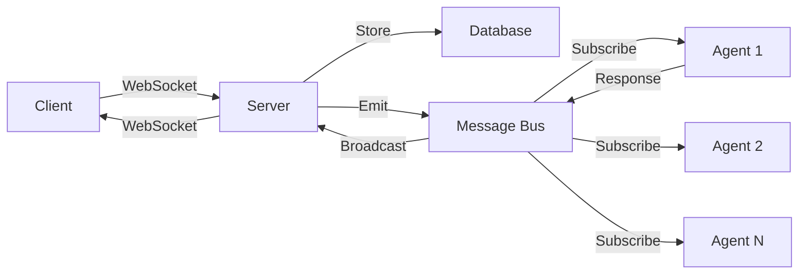

## Overview

The ElizaOS message bus is an internal event-driven communication system that enables decoupled
interaction between the server and agent runtimes. It uses Node.js EventEmitter to distribute
messages within a single process, with the flexibility to scale to distributed systems.

## Architecture

### Core Implementation

```typescript
import EventEmitter from "events";

class InternalMessageBus extends EventEmitter {}

const internalMessageBus = new InternalMessageBus();
internalMessageBus.setMaxListeners(50);

export default internalMessageBus;
```

### Message Flow



## Message Structure

Messages on the bus follow a standardized format:

```typescript
interface MessageServiceStructure {
  id: UUID;
  channel_id: UUID;
  server_id: UUID;
  author_id: UUID;
  content: string;
  raw_message: any;
  source_id?: UUID;
  source_type: string;
  in_reply_to_message_id?: UUID;
  created_at: number;
  metadata?: Record<string, any>;
}
```

## Server Integration

### Publishing Messages

When a message is created through the API or WebSocket, it's published to the bus:

```typescript
async createMessage(data: MessageData): Promise<Message> {
  const createdMessage = await database.createMessage(data);

  // Get channel details for server ID
  const channel = await this.getChannelDetails(createdMessage.channelId);

  if (channel) {
    // Format for message bus
    const messageForBus: MessageServiceStructure = {
      id: createdMessage.id,
      channel_id: createdMessage.channelId,
      server_id: channel.messageServerId,
      author_id: createdMessage.authorId,
      content: createdMessage.content,
      raw_message: createdMessage.rawMessage,
      source_id: createdMessage.sourceId,
      source_type: createdMessage.sourceType,
      in_reply_to_message_id: createdMessage.inReplyToRootMessageId,
      created_at: createdMessage.createdAt.getTime(),
      metadata: createdMessage.metadata,
    };

    // Emit to message bus
    internalMessageBus.emit('new_message', messageForBus);
    logger.info(`Published message ${createdMessage.id} to internal message bus`);
  }

  return createdMessage;
}
```

## Agent Integration

### Message Bus Connector Plugin

Agents connect to the message bus through the `messageBusConnectorPlugin`:

```typescript
export const messageBusConnectorPlugin: Plugin = {
  name: "messageBusConnector",
  description: "Connects agent to internal message bus",

  services: [
    {
      name: "messageBus",
      getInstance: (runtime: IAgentRuntime) => {
        return new MessageBusService(runtime);
      },
    },
  ],
};
```

### Message Bus Service

The service handles subscription and message processing:

```typescript
class MessageBusService extends Service {
  private runtime: IAgentRuntime;
  private isActive: boolean = false;

  constructor(runtime: IAgentRuntime) {
    super();
    this.runtime = runtime;
  }

  async start(): Promise<void> {
    if (this.isActive) return;

    // Subscribe to new messages
    internalMessageBus.on("new_message", this.handleNewMessage.bind(this));
    this.isActive = true;

    logger.info(`[MessageBusService] Started for agent ${this.runtime.agentId}`);
  }

  async stop(): Promise<void> {
    if (!this.isActive) return;

    // Unsubscribe from events
    internalMessageBus.off("new_message", this.handleNewMessage.bind(this));
    this.isActive = false;

    logger.info(`[MessageBusService] Stopped for agent ${this.runtime.agentId}`);
  }

  private async handleNewMessage(message: MessageServiceStructure) {
    try {
      // Check if agent should process this message
      if (!this.shouldProcessMessage(message)) {
        return;
      }

      // Convert to agent-compatible format
      const agentMessage = await this.convertToAgentMessage(message);

      // Process through agent runtime
      const response = await this.runtime.processMessage(agentMessage);

      // Emit response back to bus if generated
      if (response) {
        internalMessageBus.emit("agent_response", {
          originalMessage: message,
          response: response,
          agentId: this.runtime.agentId,
        });
      }
    } catch (error) {
      logger.error(`[MessageBusService] Error processing message:`, error);
    }
  }

  private shouldProcessMessage(message: MessageServiceStructure): boolean {
    // Skip messages from this agent
    if (message.author_id === this.runtime.agentId) {
      return false;
    }

    // Check if agent is assigned to this server
    const assignedServers = this.runtime.getAssignedServers();
    if (!assignedServers.includes(message.server_id)) {
      return false;
    }

    // Additional filtering logic
    return true;
  }
}
```

## Event Types

### Core Events

1. **`new_message`** - New message from any source
2. **`agent_response`** - Response generated by an agent
3. **`message_updated`** - Message content updated
4. **`message_deleted`** - Message removed
5. **`channel_created`** - New channel created
6. **`channel_updated`** - Channel metadata changed
7. **`participant_joined`** - User joined channel
8. **`participant_left`** - User left channel

### Custom Events

Plugins can emit custom events:

```typescript
// Emit custom event
internalMessageBus.emit("custom:payment_received", {
  channelId: "channel-uuid",
  amount: 100,
  currency: "USD",
  senderId: "user-uuid",
});

// Subscribe to custom event
internalMessageBus.on("custom:payment_received", (data) => {
  // Handle payment event
});
```

## Usage Examples

### Basic Message Handling

```typescript
// Subscribe to messages
internalMessageBus.on("new_message", async (message) => {
  console.log("New message:", message.content);

  // Process message
  const result = await processMessage(message);

  // Emit processing complete
  internalMessageBus.emit("message_processed", {
    messageId: message.id,
    result: result,
  });
});
```

### Filtered Subscription

```typescript
class FilteredMessageHandler {
  constructor(private filter: MessageFilter) {
    internalMessageBus.on("new_message", this.handleMessage.bind(this));
  }

  private handleMessage(message: MessageServiceStructure) {
    // Apply filter
    if (!this.filter.matches(message)) {
      return;
    }

    // Process filtered message
    this.processMessage(message);
  }

  private processMessage(message: MessageServiceStructure) {
    // Handle message that passed filter
  }
}
```

### Response Handling

```typescript
// Listen for agent responses
internalMessageBus.on("agent_response", async (data) => {
  const { originalMessage, response, agentId } = data;

  // Store response in database
  await database.createMessage({
    channelId: originalMessage.channel_id,
    authorId: agentId,
    content: response.text,
    inReplyToRootMessageId: originalMessage.id,
    metadata: {
      isAgentResponse: true,
      processingTime: response.processingTime,
    },
  });

  // Broadcast to WebSocket clients
  socketIO.to(originalMessage.channel_id).emit("messageBroadcast", {
    // ... response data
  });
});
```

## Scaling Considerations

### Current Limitations

The internal message bus is limited to a single process:

```typescript
// Only works within the same Node.js process
internalMessageBus.emit("event", data);
```

### Scaling to Multiple Processes

For multi-process deployments, replace with a distributed solution:

```typescript
// Example: Redis Pub/Sub adapter
class RedisMessageBus {
  private publisher: RedisClient;
  private subscriber: RedisClient;

  async emit(event: string, data: any) {
    await this.publisher.publish(event, JSON.stringify(data));
  }

  on(event: string, handler: Function) {
    this.subscriber.subscribe(event);
    this.subscriber.on("message", (channel, message) => {
      if (channel === event) {
        handler(JSON.parse(message));
      }
    });
  }
}
```

### Alternative Solutions

1. **Redis Pub/Sub** - Simple, low-latency
2. **RabbitMQ** - Advanced routing, reliability
3. **Kafka** - High throughput, persistence
4. **NATS** - Lightweight, cloud-native

## Performance Optimization

### Event Batching

```typescript
class BatchedMessageBus {
  private batch: MessageServiceStructure[] = [];
  private batchTimer: NodeJS.Timeout | null = null;

  emit(event: string, message: MessageServiceStructure) {
    this.batch.push(message);

    if (this.batch.length >= 100) {
      this.flush();
    } else if (!this.batchTimer) {
      this.batchTimer = setTimeout(() => this.flush(), 100);
    }
  }

  private flush() {
    if (this.batch.length > 0) {
      internalMessageBus.emit("batch_messages", this.batch);
      this.batch = [];
    }

    if (this.batchTimer) {
      clearTimeout(this.batchTimer);
      this.batchTimer = null;
    }
  }
}
```

### Memory Management

```typescript
// Set reasonable listener limits
internalMessageBus.setMaxListeners(50);

// Clean up listeners when done
const handler = (data) => {
  /* ... */
};
internalMessageBus.on("event", handler);

// Later...
internalMessageBus.off("event", handler);
```

## Error Handling

### Graceful Error Recovery

```typescript
internalMessageBus.on("new_message", async (message) => {
  try {
    await processMessage(message);
  } catch (error) {
    logger.error("Message processing failed:", error);

    // Emit error event
    internalMessageBus.emit("message_error", {
      messageId: message.id,
      error: error.message,
      timestamp: Date.now(),
    });

    // Implement retry logic if needed
    if (shouldRetry(error)) {
      setTimeout(() => {
        internalMessageBus.emit("new_message", message);
      }, 5000);
    }
  }
});
```

### Dead Letter Queue

```typescript
class MessageBusWithDLQ {
  private dlq: MessageServiceStructure[] = [];

  async processWithRetry(message: MessageServiceStructure, maxRetries = 3) {
    let retries = 0;

    while (retries < maxRetries) {
      try {
        await this.processMessage(message);
        return;
      } catch (error) {
        retries++;
        logger.warn(`Processing attempt ${retries} failed:`, error);

        if (retries >= maxRetries) {
          // Send to dead letter queue
          this.dlq.push({
            ...message,
            metadata: {
              ...message.metadata,
              dlq_reason: error.message,
              dlq_timestamp: Date.now(),
            },
          });
        }
      }
    }
  }
}
```

## Monitoring and Debugging

### Event Logging

```typescript
// Log all events in development
if (process.env.NODE_ENV === "development") {
  const originalEmit = internalMessageBus.emit;
  internalMessageBus.emit = function (event: string, ...args: any[]) {
    logger.debug(`[MessageBus] Event: ${event}`, args);
    return originalEmit.apply(this, [event, ...args]);
  };
}
```

### Performance Metrics

```typescript
class MonitoredMessageBus {
  private metrics = {
    eventCounts: new Map<string, number>(),
    processingTimes: new Map<string, number[]>(),
  };

  emit(event: string, data: any) {
    // Track event count
    const count = this.metrics.eventCounts.get(event) || 0;
    this.metrics.eventCounts.set(event, count + 1);

    // Emit with timing
    const startTime = Date.now();
    internalMessageBus.emit(event, data);

    // Track processing time
    const times = this.metrics.processingTimes.get(event) || [];
    times.push(Date.now() - startTime);
    this.metrics.processingTimes.set(event, times);
  }

  getMetrics() {
    return {
      eventCounts: Object.fromEntries(this.metrics.eventCounts),
      avgProcessingTimes: Object.fromEntries(
        Array.from(this.metrics.processingTimes.entries()).map(([event, times]) => [
          event,
          times.reduce((a, b) => a + b, 0) / times.length,
        ])
      ),
    };
  }
}
```

## Best Practices

1. **Event Naming**: Use descriptive, namespaced events

   ```typescript
   "message:created";
   "channel:updated";
   "agent:response_generated";
   ```

2. **Payload Validation**: Always validate event data

   ```typescript
   if (!isValidMessage(data)) {
     logger.error('Invalid message data');
     return;
   }
   ```

3. **Error Isolation**: Don't let one handler break others

   ```typescript
   process.on("uncaughtException", (error) => {
     logger.error("Uncaught exception in message bus:", error);
   });
   ```

4. **Memory Leaks**: Clean up listeners properly

   ```typescript
   class Component {
     onDestroy() {
       internalMessageBus.removeAllListeners("my_event");
     }
   }
   ```

5. **Testing**: Mock the message bus in tests
   ```typescript
   jest.mock("./bus", () => ({
     emit: jest.fn(),
     on: jest.fn(),
     off: jest.fn(),
   }));
   ```

## Conclusion

The ElizaOS message bus provides a simple yet powerful mechanism for internal communication between
server components and agent runtimes. While currently limited to single-process deployments, its
event-driven architecture makes it easy to scale to distributed systems when needed.
