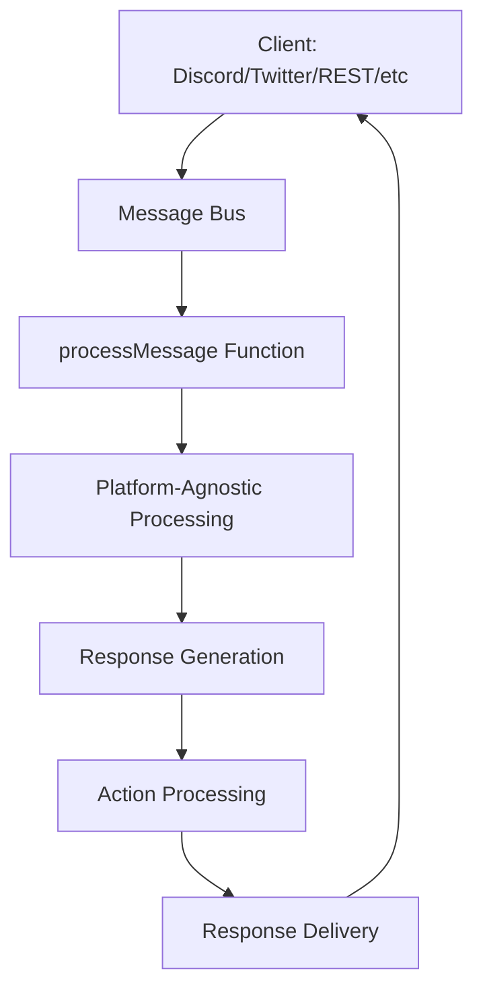

Message handlers are the core processing units in ElizaOS that handle incoming messages, generate
responses, and execute actions. The bootstrap plugin provides the primary message handling pipeline,
orchestrating the entire agent response lifecycle from message reception to final output.

<Callout type="info">
**IMPORTANT - Platform-Agnostic Design**: The `processMessage` function is **NOT Discord-specific** - it is **completely platform-agnostic**. Whether messages come from Discord, Twitter, Telegram, REST API, WebSocket, or any other client, they ALL go through the exact same `processMessage` function in the AgentRuntime. 

The client type only affects:
1. How messages are initially ingested (format conversion)
2. How responses are delivered back to the platform
3. Platform-specific features (e.g., Discord embeds, Twitter character limits)

The core message processing, decision making, and response generation are 100% identical across all platforms.
</Callout>

## Message Processing Pipeline

The message processing pipeline follows these key stages:



1. **Message Reception**: Incoming messages are received via the message bus from any client (Discord, Twitter, REST API, etc.)
2. **Validation**: Message and agent validation checks
3. **Memory Storage**: Message saved to agent memory
4. **Response Decision**: Determine if the agent should respond (using customizable templates)
5. **Response Generation**: Create appropriate response content (using customizable templates)
6. **Action Processing**: Execute any required actions
7. **Response Delivery**: Send response back through the message bus to the originating client

## MessageBusService

The `MessageBusService` is the intermediary that connects agents to the central message bus and
handles message routing:

```typescript
export class MessageBusService extends Service {
  static serviceType = "message-bus-service";
  capabilityDescription = "Manages connection and message synchronization with the message server.";

  private boundHandleIncomingMessage: (message: MessageServiceMessage) => Promise<void>;
  private validChannelIds: Set<UUID> = new Set();
  private subscribedServers: Set<UUID> = new Set();
}
```

### Message Flow Through MessageBusService

1. **Subscription**: Service subscribes to internal message bus events from all client types
2. **Validation**: Validates server subscription and channel participation
3. **Processing**: Converts message format and emits to agent runtime (**same `processMessage` for all clients**)
4. **Response**: Handles agent responses and sends back to central bus for client delivery

<Callout type="info">
Regardless of whether a message comes from Discord, Twitter, Telegram, REST API, or any other source, it gets converted to the same internal format and processed by the same `processMessage` function. The platform differences are abstracted away at the client layer.
</Callout>

```typescript
private async handleIncomingMessage(message: MessageServiceMessage) {
  // Validate channel participation
  const participants = await this.getChannelParticipants(message.channel_id);
  if (!participants.includes(this.runtime.agentId)) {
    return;
  }

  // Create agent memory from message
  const agentMemory = this.createAgentMemory(message, ...);

  // Emit to runtime for processing
  await this.runtime.emitEvent(EventType.MESSAGE_RECEIVED, {
    runtime: this.runtime,
    message: agentMemory,
    callback: this.handleAgentResponse.bind(this)
  });
}
```

## Main Message Handler

The primary message handler is implemented in the bootstrap plugin:

```typescript
const messageReceivedHandler = async ({
  runtime,
  message,
  callback,
  onComplete,
}: MessageReceivedHandlerParams): Promise<void> => {
  // Set up timeout monitoring
  const timeoutDuration = 60 * 60 * 1000; // 1 hour
  let timeoutId: NodeJS.Timeout | undefined = undefined;

  try {
    logger.info(`Message received from ${message.entityId} in room ${message.roomId}`);

    // Generate response ID for tracking
    const responseId = v4();

    // Track latest response per agent+room
    const agentResponses = latestResponseIds.get(runtime.agentId) || new Map();
    agentResponses.set(message.roomId, responseId);
    latestResponseIds.set(runtime.agentId, agentResponses);

    // Start run tracking
    const runId = runtime.startRun();
    const startTime = Date.now();

    // Process message with timeout protection
    await processMessage(runtime, message, callback, responseId, runId, startTime);
  } catch (error) {
    logger.error("Message processing failed:", error);
    throw error;
  } finally {
    clearTimeout(timeoutId);
    onComplete?.();
  }
};
```

## Response Decision Logic

### shouldRespond Evaluation

The handler determines whether to respond based on various factors:

```typescript
// Skip shouldRespond check for certain channel types
const shouldSkipShouldRespond = shouldBypassShouldRespond(runtime, room, message.content.source);

if (!shouldSkipShouldRespond) {
  // Evaluate if agent should respond using customizable template
  const shouldRespondPrompt = composePromptFromState({
    state,
    template: runtime.character.templates?.shouldRespondTemplate || shouldRespondTemplate,
  });

  const response = await runtime.useModel(ModelType.TEXT_SMALL, {
    prompt: shouldRespondPrompt,
  });

  const responseObject = parseKeyValueXml(response);

  // Non-response actions
  const nonResponseActions = ["IGNORE", "NONE"];
  shouldRespond =
    responseObject?.action && !nonResponseActions.includes(responseObject.action.toUpperCase());
}
```

## Available Prompt Templates

ElizaOS uses several key prompt templates that can be customized:

### Core Message Processing Templates

#### shouldRespondTemplate
Determines if the agent should respond to a message:

```typescript
export const shouldRespondTemplate = `<task>Decide on behalf of {{agentName}} whether they should respond to the message, ignore it or stop the conversation.</task>

<providers>
{{providers}}
</providers>

<instructions>Decide if {{agentName}} should respond to or interact with the conversation.
If the message is directed at or relevant to {{agentName}}, respond with RESPOND action.
If a user asks {{agentName}} to be quiet, respond with STOP action.
If {{agentName}} should ignore the message, respond with IGNORE action.</instructions>

<output>
<response>
  <name>{{agentName}}</name>
  <reasoning>Your reasoning here</reasoning>
  <action>RESPOND | IGNORE | STOP</action>
</response>
</output>`;
```

#### messageHandlerTemplate
Generates the agent's response and determines actions:

```typescript
export const messageHandlerTemplate = `<task>Generate dialog and actions for the character {{agentName}}.</task>

<providers>
{{providers}}
</providers>

These are the available valid actions:
<actionNames>
{{actionNames}}
</actionNames>

<instructions>
Write a thought and plan for {{agentName}} and decide what actions to take.

IMPORTANT ACTION ORDERING RULES:
- Actions are executed in the ORDER you list them
- REPLY should come FIRST to acknowledge the user's request
- Common patterns:
  - For requests: REPLY,CALL_MCP_TOOL
  - For tasks: REPLY,SEND_MESSAGE
  - For multi-step: REPLY,ACTION1,ACTION2
</instructions>

<output>
<response>
    <thought>Your thought here</thought>
    <actions>ACTION1,ACTION2</actions>
    <providers>PROVIDER1,PROVIDER2</providers>
    <text>Your response text here</text>
</response>
</output>`;
```

### Content Creation Templates

#### postCreationTemplate
For creating social media posts:

```typescript
export const postCreationTemplate = `# Task: Create a post in the voice and style of {{agentName}}.

<response>
  <thought>I am thinking about writing a post about [topic]</thought>
  <post>The actual post content</post>
  <imagePrompt>A description for an image to accompany the post</imagePrompt>
</response>`;
```

#### imageDescriptionTemplate
For processing and describing images:

```typescript
export const imageDescriptionTemplate = `<task>Describe the image for {{agentName}}</task>

<output>
<response>
  <title>Short title for the image</title>
  <description>Detailed description of what's in the image</description>
  <text>Natural language description as if explaining to someone</text>
</response>
</output>`;
```

### Specialized Templates

#### continueTemplate
For continuing conversations:

```typescript
export const continueTemplate = `<task>Continue the conversation as {{agentName}}</task>

<instructions>
Continue naturally, maintaining character personality and context.
</instructions>`;
```

#### evaluationTemplate
For evaluating content or situations:

```typescript
export const evaluationTemplate = `<task>Evaluate the following as {{agentName}}</task>

<instructions>
Provide thoughtful evaluation based on the character's knowledge and perspective.
</instructions>`;
```

### Customizing Templates

You can customize templates at three levels:

#### 1. Character-Level Customization

```json
{
  "name": "TechSupport",
  "bio": ["Technical support specialist"],
  "templates": {
    "shouldRespondTemplate": "<task>As a tech support agent, determine if this message needs assistance...</task>",
    "messageHandlerTemplate": "<task>Provide technical support as {{agentName}}...</task>",
    "postCreationTemplate": "<task>Create a tech tip post...</task>"
  }
}
```

#### 2. Runtime Template Override

```typescript
// Override templates during runtime
runtime.character.templates = {
  ...runtime.character.templates,
  messageHandlerTemplate: customMessageTemplate,
  shouldRespondTemplate: customShouldRespondTemplate
};
```

#### 3. Plugin-Based Templates

```typescript
export const customPlugin: Plugin = {
  name: 'custom-templates',
  actions: [],
  providers: [],
  evaluators: [],
  services: [],
  
  // Initialize custom templates
  async onInitialize(runtime: IAgentRuntime) {
    if (!runtime.character.templates) {
      runtime.character.templates = {};
    }
    
    // Set custom templates based on character type
    if (runtime.character.type === 'support') {
      runtime.character.templates.messageHandlerTemplate = supportAgentTemplate;
      runtime.character.templates.shouldRespondTemplate = supportShouldRespondTemplate;
    }
  }
};
```

### Template Variables Reference

All templates have access to these variables:

| Variable | Description | Example Value |
|----------|-------------|---------------|
| `{{agentName}}` | The agent's character name | "TechHelper" |
| `{{providers}}` | Formatted provider data | "KNOWLEDGE: ...\nFACTS: ..." |
| `{{actionNames}}` | Available action names | "REPLY,IGNORE,FOLLOW_ROOM" |
| `{{recentMessages}}` | Recent conversation history | Last N messages |
| `{{relevantKnowledge}}` | Knowledge base matches | Related facts |
| `{{characterBio}}` | Agent's bio | Character background |
| `{{messageText}}` | Current message content | "Hello, can you help?" |
| `{{userName}}` | Message author's name | "John Doe" |
| `{{roomId}}` | Current room/channel ID | UUID |
| `{{worldContext}}` | World/environment data | Context information |

### Bypass Conditions

Certain conditions automatically bypass the shouldRespond check:

```typescript
export function shouldBypassShouldRespond(
  runtime: IAgentRuntime,
  room?: Room,
  source?: string
): boolean {
  const defaultBypassTypes = [
    ChannelType.DM,         // Direct messages from any platform
    ChannelType.VOICE_DM,   // Voice DMs from any platform
    ChannelType.SELF,       // Self-messages
    ChannelType.API,        // API-initiated messages
  ];

  const defaultBypassSources = [
    "client_chat",   // Web UI chat
    "api",          // REST API
    "postman",      // Postman testing
  ];

  // Check room type and source (platform-agnostic)
  const roomType = room?.type?.toString().toLowerCase();
  const sourceStr = source?.toLowerCase() || "";

  return bypassTypes.has(roomType) || bypassSources.some((pattern) => sourceStr.includes(pattern));
}
```

## Response Generation

### Content Generation

When the agent decides to respond, it generates content using the message handler template:

```typescript
if (shouldRespond) {
  // Compose state with action information
  state = await runtime.composeState(message, ["ACTIONS"]);

  const prompt = composePromptFromState({
    state,
    template: runtime.character.templates?.messageHandlerTemplate || messageHandlerTemplate,
  });

  let responseContent: Content | null = null;
  let retries = 0;
  const maxRetries = 3;

  // Retry mechanism for incomplete responses
  while (retries < maxRetries && (!responseContent?.thought || !responseContent?.actions)) {
    let response = await runtime.useModel(ModelType.TEXT_LARGE, {
      prompt,
    });

    // Parse XML response
    const parsedXml = parseKeyValueXml(response);

    if (parsedXml) {
      responseContent = {
        thought: parsedXml.thought || "",
        actions: parsedXml.actions || ["IGNORE"],
        providers: parsedXml.providers || [],
        text: parsedXml.text || "",
        simple: parsedXml.simple || false,
      };
    }

    retries++;
  }
}
```

### Response Formatting

The response is formatted and prepared for delivery:

```typescript
if (responseContent && message.id) {
  responseContent.inReplyTo = createUniqueUuid(runtime, message.id);

  // Determine if response is simple
  const isSimple =
    responseContent.actions?.length === 1 &&
    responseContent.actions[0].toUpperCase() === "REPLY" &&
    (!responseContent.providers || responseContent.providers.length === 0);

  responseContent.simple = isSimple;

  const responseMessage = {
    id: asUUID(v4()),
    entityId: runtime.agentId,
    agentId: runtime.agentId,
    content: responseContent,
    roomId: message.roomId,
    createdAt: Date.now(),
  };

  responseMessages = [responseMessage];
}
```

## Action Processing

### Simple Responses

For simple responses (text-only), the handler executes the callback directly:

```typescript
if (responseContent && responseContent.simple && responseContent.text) {
  // Log provider usage for simple responses
  if (responseContent.providers && responseContent.providers.length > 0) {
    logger.debug("Simple response used providers", responseContent.providers);
  }

  // Execute callback with response content
  await callback(responseContent);
} else {
  // Process complex actions
  await runtime.processActions(message, responseMessages, state, callback);
}
```

### Complex Action Processing

For complex responses, the runtime processes actions:

```typescript
// Runtime processes actions based on responseContent.actions
await runtime.processActions(message, responseMessages, state, callback);

// Common actions include:
// - REPLY: Send text response
// - IGNORE: No response
// - FOLLOW_ROOM: Follow room updates
// - SEND_MESSAGE: Send targeted message
// - UPDATE_ENTITY: Update entity information
```

## Attachment Processing

The handler processes various attachment types:

```typescript
export async function processAttachments(
  attachments: Media[],
  runtime: IAgentRuntime
): Promise<Media[]> {
  const processedAttachments: Media[] = [];

  for (const attachment of attachments) {
    const processedAttachment: Media = { ...attachment };

    // Process images
    if (attachment.contentType === ContentType.IMAGE && !attachment.description) {
      const response = await runtime.useModel(ModelType.IMAGE_DESCRIPTION, {
        prompt: imageDescriptionTemplate,
        imageUrl: attachment.url,
      });

      const parsedXml = parseKeyValueXml(response);
      if (parsedXml?.description) {
        processedAttachment.description = parsedXml.description;
        processedAttachment.title = parsedXml.title || "Image";
        processedAttachment.text = parsedXml.text;
      }
    }

    // Process documents
    if (attachment.contentType === ContentType.DOCUMENT && !attachment.text) {
      const res = await fetch(attachment.url);
      const contentType = res.headers.get("content-type") || "";

      if (contentType.startsWith("text/plain")) {
        const textContent = await res.text();
        processedAttachment.text = textContent;
        processedAttachment.title = processedAttachment.title || "Text File";
      }
    }

    processedAttachments.push(processedAttachment);
  }

  return processedAttachments;
}
```

## Memory Management

### Message Storage

Messages are stored in both embeddings and message memory:

```typescript
// Save incoming message to memory
await Promise.all([
  runtime.addEmbeddingToMemory(message),
  runtime.createMemory(message, "messages"),
]);
```

### Response Tracking

The system tracks response IDs to prevent duplicate processing:

```typescript
const latestResponseIds = new Map<string, Map<string, string>>();

// Set latest response ID for agent+room
const agentResponses = latestResponseIds.get(runtime.agentId) || new Map();
agentResponses.set(message.roomId, responseId);

// Check if still latest before processing
const currentResponseId = agentResponses.get(message.roomId);
if (currentResponseId !== responseId) {
  logger.info('Response discarded - newer message being processed');
  return;
}
```

## Ignore Handling

When the agent decides not to respond, it still creates a memory entry:

```typescript
if (!shouldRespond) {
  // Create ignore content
  const ignoreContent: Content = {
    thought: "Agent decided not to respond to this message.",
    actions: ["IGNORE"],
    simple: true,
    inReplyTo: createUniqueUuid(runtime, message.id),
  };

  // Execute callback with ignore content
  await callback(ignoreContent);

  // Save ignore decision to memory
  const ignoreMemory = {
    id: asUUID(v4()),
    entityId: runtime.agentId,
    agentId: runtime.agentId,
    content: ignoreContent,
    roomId: message.roomId,
    createdAt: Date.now(),
  };

  await runtime.createMemory(ignoreMemory, "messages");
}
```

## Error Handling

### Timeout Protection

Messages are processed with timeout protection:

```typescript
const timeoutDuration = 60 * 60 * 1000; // 1 hour
const timeoutPromise = new Promise<never>((_, reject) => {
  timeoutId = setTimeout(async () => {
    await runtime.emitEvent(EventType.RUN_TIMEOUT, {
      runtime,
      runId,
      messageId: message.id,
      roomId: message.roomId,
      entityId: message.entityId,
      startTime,
      status: "timeout",
      endTime: Date.now(),
      duration: Date.now() - startTime,
      error: "Run exceeded 60 minute timeout",
      source: "messageHandler",
    });
    reject(new Error("Run exceeded 60 minute timeout"));
  }, timeoutDuration);
});

await Promise.race([processingPromise, timeoutPromise]);
```

### Graceful Degradation

```typescript
try {
  await processMessage(runtime, message, callback);
} catch (error) {
  logger.error("Message processing failed:", error);

  // Emit run ended event with error
  await runtime.emitEvent(EventType.RUN_ENDED, {
    runtime,
    runId,
    messageId: message.id,
    roomId: message.roomId,
    entityId: message.entityId,
    startTime,
    status: "error",
    endTime: Date.now(),
    duration: Date.now() - startTime,
    error: error.message,
    source: "messageHandler",
  });
}
```

## Specialized Handlers

### Reaction Handler

```typescript
const reactionReceivedHandler = async ({
  runtime,
  message,
}: {
  runtime: IAgentRuntime;
  message: Memory;
}) => {
  try {
    await runtime.createMemory(message, "messages");
  } catch (error: any) {
    if (error.code === "23505") {
      logger.warn("Duplicate reaction memory, skipping");
      return;
    }
    logger.error("Error in reaction handler:", error);
  }
};
```

### Message Deletion Handler

```typescript
const messageDeletedHandler = async ({
  runtime,
  message,
}: {
  runtime: IAgentRuntime;
  message: Memory;
}) => {
  try {
    if (!message.id) {
      logger.error("Cannot delete memory: message ID is missing");
      return;
    }

    logger.info("Deleting memory for message", message.id);
    await runtime.deleteMemory(message.id);
  } catch (error) {
    logger.error("Error in message deleted handler:", error);
  }
};
```

### Channel Cleared Handler

```typescript
const channelClearedHandler = async ({
  runtime,
  roomId,
  channelId,
  memoryCount,
}: {
  runtime: IAgentRuntime;
  roomId: UUID;
  channelId: string;
  memoryCount: number;
}) => {
  try {
    logger.info(`Clearing ${memoryCount} message memories from channel ${channelId}`);

    const memories = await runtime.getMemoriesByRoomIds({
      tableName: "messages",
      roomIds: [roomId],
    });

    let deletedCount = 0;
    for (const memory of memories) {
      if (memory.id) {
        try {
          await runtime.deleteMemory(memory.id);
          deletedCount++;
        } catch (error) {
          logger.warn(`Failed to delete message memory ${memory.id}:`, error);
        }
      }
    }

    logger.info(`Successfully cleared ${deletedCount}/${memories.length} message memories`);
  } catch (error) {
    logger.error("Error in channel cleared handler:", error);
  }
};
```

## Handler Registration

Message handlers are registered through the bootstrap plugin:

```typescript
const events = {
  [EventType.MESSAGE_RECEIVED]: [
    async (payload: MessagePayload) => {
      if (!payload.callback) {
        logger.error("No callback provided for message");
        return;
      }
      await messageReceivedHandler({
        runtime: payload.runtime,
        message: payload.message,
        callback: payload.callback,
        onComplete: payload.onComplete,
      });
    },
  ],

  [EventType.VOICE_MESSAGE_RECEIVED]: [
    async (payload: MessagePayload) => {
      // Use same handler for voice messages
      await messageReceivedHandler({
        runtime: payload.runtime,
        message: payload.message,
        callback: payload.callback,
        onComplete: payload.onComplete,
      });
    },
  ],

  [EventType.REACTION_RECEIVED]: [
    async (payload: MessagePayload) => {
      await reactionReceivedHandler({
        runtime: payload.runtime,
        message: payload.message,
      });
    },
  ],

  [EventType.MESSAGE_DELETED]: [
    async (payload: MessagePayload) => {
      await messageDeletedHandler({
        runtime: payload.runtime,
        message: payload.message,
      });
    },
  ],

  [EventType.CHANNEL_CLEARED]: [
    async (payload: EventPayload & { roomId: UUID; channelId: string; memoryCount: number }) => {
      await channelClearedHandler({
        runtime: payload.runtime,
        roomId: payload.roomId,
        channelId: payload.channelId,
        memoryCount: payload.memoryCount,
      });
    },
  ],
};

export const bootstrapPlugin: Plugin = {
  name: "bootstrap",
  description: "Agent bootstrap with basic actions and evaluators",
  events: events as any as PluginEvents,
  // ... other plugin properties
};
```

## Performance Considerations

### Concurrent Processing

The system supports concurrent message processing while preventing response conflicts:

```typescript
// Each agent+room combination tracks its latest response
const latestResponseIds = new Map<string, Map<string, string>>();

// Concurrent safety check
const currentResponseId = agentResponses.get(message.roomId);
if (currentResponseId !== responseId) {
  logger.info('Response discarded - newer message being processed');
  return;
}
```

### Memory Optimization

```typescript
// Clean up response tracking
agentResponses.delete(message.roomId);
if (agentResponses.size === 0) {
  latestResponseIds.delete(runtime.agentId);
}
```

Message handlers provide the essential processing logic that enables elizaOS agents to understand,
process, and respond to incoming messages in a robust and scalable manner. The bootstrap plugin's
handler implementation serves as the foundation for all agent communication capabilities.
