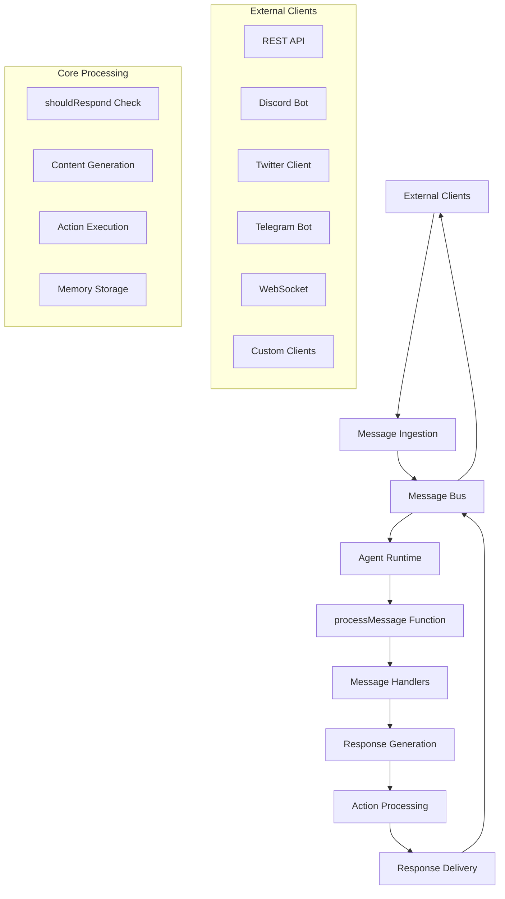

This document provides a comprehensive overview of the ElizaOS communication architecture, bringing together all aspects of agent communication, message processing, and API usage.

## Architecture Overview

ElizaOS uses a unified communication architecture that processes messages identically regardless of their source. This design ensures consistent agent behavior across all platforms.

<Callout type="info">
**Key Principle**: The `processMessage` function is **completely platform-agnostic**. Whether a message comes from Discord, Twitter, REST API, WebSocket, or any other client, it follows the same processing pipeline once it enters the system through the message bus.
</Callout>

### Unified Message Flow



## Communication Components

### 1. Message Bus Architecture

The central message bus coordinates all communication:

- **Ingestion**: Accepts messages from any client type
- **Routing**: Routes messages to appropriate agents
- **Processing**: Ensures platform-agnostic message handling
- **Delivery**: Returns responses to originating clients

### 2. REST API Endpoints

The REST API provides HTTP-based communication:

#### Core Endpoints

| Endpoint | Purpose | Example Usage |
|----------|---------|---------------|
| `POST /api/messaging/ingest-external` | Send messages to agents | User interactions |
| `GET /api/messaging/central-channels/{id}/messages` | Retrieve conversation history | Chat interfaces |
| `POST /api/agents` | Create new agents | Agent management |
| `POST /api/agents/{id}/start` | Start agent instances | System initialization |

#### Complete API Structure

```
/api/
├── agents/                 # Agent management
├── messaging/             # Message handling
├── media/                 # File uploads
├── memory/                # Memory operations
├── audio/                 # Audio processing
├── server/                # Runtime management
├── system/                # System status
└── tee/                   # TEE operations
```

### 3. Message Processing Pipeline

All messages follow this standardized pipeline:

<Steps>

<Step>
## Message Reception
- External client sends message
- Platform-specific client converts to standard format
- Message enters the message bus
</Step>

<Step>
## Message Validation
- Format validation
- Agent availability check
- Channel/room verification
</Step>

<Step>
## Memory Storage
- Save incoming message to agent memory
- Update conversation context
- Store embeddings for semantic search
</Step>

<Step>
## Response Decision
- Run `shouldRespond` evaluation
- Check bypass conditions (DMs, API calls)
- Determine if agent should respond
</Step>

<Step>
## Response Generation
- Compose state with providers
- Generate response using message handler template
- Parse actions and content
</Step>

<Step>
## Action Processing
- Execute determined actions in order
- Handle simple responses directly
- Process complex actions through runtime
</Step>

<Step>
## Response Delivery
- Format response for target client
- Send through message bus
- Handle delivery confirmation
</Step>

</Steps>

## Client Types

### Supported Platforms

| Client Type | Features | Use Cases |
|-------------|----------|-----------|
| **REST API** | HTTP endpoints, file uploads, WebSocket real-time | Web apps, custom integrations |
| **Discord** | Rich embeds, voice, slash commands, threads | Gaming communities, servers |
| **Twitter** | Tweets, DMs, mentions, media | Public engagement, social presence |
| **Telegram** | Inline keyboards, media, voice messages | Customer support, personal bots |
| **WebSocket** | Real-time bidirectional communication | Live chat, streaming |
| **Slack** | Channels, DMs, slash commands, apps | Team collaboration |
| **Matrix** | E2E encryption, federation, rich media | Decentralized communication |

### Platform-Agnostic Processing

Key insight: **All platforms use the same core processing logic**

```typescript
// This function processes messages identically for ALL clients
async function processMessage(
  runtime: IAgentRuntime,
  message: Memory,      // Standardized message format
  callback: HandlerCallback
): Promise<void> {
  // Same logic regardless of source platform
  // 1. shouldRespond evaluation
  // 2. Response generation
  // 3. Action processing
  // 4. Memory storage
}
```

## Message Structure

### Universal Message Format

All messages are converted to this standard format:

```typescript
interface Memory {
  id: UUID;                    // Unique message identifier
  content: {
    text: string;              // Message text content
    source: string;            // 'discord', 'twitter', 'api', etc.
    attachments?: Attachment[]; // Media attachments
    metadata?: any;            // Platform-specific data
  };
  entityId: UUID;              // Author/sender ID
  roomId: UUID;                // Channel/conversation ID
  createdAt: number;           // Timestamp
}
```

### Platform-Specific Conversion

Each client converts platform messages to the universal format:

```typescript
// Discord message conversion
const memory: Memory = {
  id: discordMessage.id,
  content: {
    text: discordMessage.content,
    source: 'discord',
    attachments: convertDiscordAttachments(discordMessage.attachments)
  },
  entityId: discordMessage.author.id,
  roomId: discordMessage.channel.id,
  createdAt: discordMessage.createdTimestamp
};

// REST API message conversion  
const memory: Memory = {
  id: generateUUID(),
  content: {
    text: apiRequest.content,
    source: 'api',
    attachments: apiRequest.attachments
  },
  entityId: apiRequest.author_id,
  roomId: apiRequest.channel_id,
  createdAt: Date.now()
};
```

## Prompt Templates

### Core Templates

ElizaOS uses several key templates that control agent behavior:

1. **shouldRespondTemplate**: Determines if agent should respond
2. **messageHandlerTemplate**: Generates response content and actions
3. **postCreationTemplate**: Creates social media posts
4. **imageDescriptionTemplate**: Describes image attachments

### Template Customization

Templates can be customized at the character level:

```json
{
  "name": "TechSupportBot",
  "templates": {
    "messageHandlerTemplate": "Custom template for technical support responses...",
    "shouldRespondTemplate": "Custom logic for when to provide support..."
  }
}
```

### Template Variables

Templates use variable interpolation:

```xml
<task>Generate response as {{agentName}} for {{userName}}</task>
<context>{{providers}}</context>
<actions>{{actionNames}}</actions>
```

## API Usage Patterns

### Basic Message Flow

1. **Send Message**:
```bash
curl -X POST /api/messaging/ingest-external \
  -H "Content-Type: application/json" \
  -d '{
    "channel_id": "channel-123",
    "server_id": "00000000-0000-0000-0000-000000000000", 
    "author_id": "user-456",
    "content": "Hello, how can you help me?",
    "source_type": "api"
  }'
```

2. **Get Response**:
```bash
curl /api/messaging/central-channels/channel-123/messages?limit=5
```

### Advanced Patterns

#### Streaming Responses
Combine REST API with WebSocket for real-time updates:

```javascript
// Send via REST
await fetch('/api/messaging/ingest-external', {
  method: 'POST',
  body: JSON.stringify(message)
});

// Listen via WebSocket
socket.on('messageBroadcast', (response) => {
  console.log('Agent response:', response);
});
```

#### Batch Processing
Process multiple messages efficiently:

```javascript
const messages = ['Hello', 'How are you?', 'What can you do?'];
for (const text of messages) {
  await sendMessage(channelId, userId, text);
  await new Promise(resolve => setTimeout(resolve, 1000));
}
```

## Error Handling

### Common Error Types

| Error Code | Description | Handling |
|------------|-------------|-----------|
| 400 | Bad Request - Invalid message format | Validate input |
| 401 | Unauthorized - Missing/invalid API key | Check authentication |
| 404 | Not Found - Agent/channel not found | Verify IDs |
| 429 | Rate Limited - Too many requests | Implement backoff |
| 500 | Internal Error - Server/processing error | Retry with exponential backoff |

### Resilient Implementation

```typescript
async function sendMessageWithRetry(
  message: any,
  maxRetries = 3
): Promise<any> {
  for (let attempt = 0; attempt < maxRetries; attempt++) {
    try {
      return await sendMessage(message);
    } catch (error) {
      if (error.status === 429) {
        // Rate limited - wait and retry
        const retryAfter = error.headers['retry-after'] || 5;
        await new Promise(resolve => setTimeout(resolve, retryAfter * 1000));
      } else if (error.status >= 500) {
        // Server error - exponential backoff
        await new Promise(resolve => 
          setTimeout(resolve, Math.pow(2, attempt) * 1000)
        );
      } else {
        // Non-retryable error
        throw error;
      }
    }
  }
  throw new Error('Max retries exceeded');
}
```

## Performance Considerations

### Optimization Strategies

1. **Connection Pooling**: Reuse HTTP connections
2. **Message Batching**: Group multiple messages
3. **Caching**: Cache agent responses for similar queries
4. **Compression**: Use gzip for large payloads
5. **Rate Limiting**: Respect platform limits

### Monitoring

Track key metrics:

```typescript
const metrics = {
  messageProcessingTime: histogram('message_processing_seconds'),
  messageVolume: counter('messages_processed_total'),
  errorRate: counter('message_errors_total'),
  activeConnections: gauge('active_connections')
};
```

## Best Practices

### 1. Consistent User Identity

Maintain stable user IDs across sessions:

```typescript
// Good: Consistent ID based on user identifier
const userId = `user-${hashEmail(userEmail)}`;

// Bad: Random ID each time
const userId = `user-${Math.random()}`;
```

### 2. Proper Error Handling

Always handle errors gracefully:

```typescript
try {
  const response = await sendMessage(message);
  return response;
} catch (error) {
  logger.error('Message send failed:', error);
  
  // Provide fallback response
  return {
    success: false,
    error: 'Unable to process message. Please try again.'
  };
}
```

### 3. Include Context

Provide relevant metadata:

```json
{
  "metadata": {
    "platform": "web-app",
    "version": "1.0.0",
    "sessionId": "session-123",
    "userAgent": "Mozilla/5.0...",
    "timestamp": 1704067200000
  }
}
```

### 4. Implement Timeouts

Set appropriate timeouts:

```typescript
const response = await Promise.race([
  sendMessage(message),
  new Promise((_, reject) => 
    setTimeout(() => reject(new Error('Timeout')), 30000)
  )
]);
```

## Testing Strategies

### Unit Testing

Test message processing logic:

```typescript
describe('Message Processing', () => {
  it('should process API messages correctly', async () => {
    const runtime = createTestRuntime();
    const message = createTestMessage({
      content: 'Hello',
      source: 'api'
    });
    
    const response = await runtime.processMessage(message);
    
    expect(response).toBeDefined();
    expect(response.content.text).toContain('hello');
  });
});
```

### Integration Testing

Test full API flows:

```typescript
describe('REST API Integration', () => {
  it('should handle complete message flow', async () => {
    // Send message
    const result = await client.sendMessage(
      'channel-123',
      'user-456', 
      'Test message'
    );
    
    expect(result.success).toBe(true);
    
    // Check for response
    const messages = await client.getMessages('channel-123');
    const agentResponse = messages.find(m => m.authorId === agentId);
    
    expect(agentResponse).toBeDefined();
  });
});
```

## Migration and Upgrades

### Version Compatibility

When upgrading ElizaOS:

1. Check API version compatibility
2. Update client libraries
3. Test message processing
4. Verify template compatibility
5. Update authentication if needed

### Breaking Changes

Monitor for breaking changes in:

- Message format structure
- API endpoint changes
- Authentication requirements
- Template variable changes
- Error response format

## Security Considerations

### Authentication

Implement proper API authentication:

```typescript
// Environment variable for API key
const apiKey = process.env.ELIZA_SERVER_AUTH_TOKEN;

// Include in requests
const headers = {
  'Content-Type': 'application/json',
  'X-API-KEY': apiKey
};
```

### Input Validation

Validate all inputs:

```typescript
function validateMessage(message: any): boolean {
  return (
    typeof message.content === 'string' &&
    message.content.length <= 4000 &&
    isValidUUID(message.channel_id) &&
    isValidUUID(message.author_id)
  );
}
```

### Rate Limiting

Implement client-side rate limiting:

```typescript
class RateLimitedClient {
  private requestQueue: Promise<any>[] = [];
  private maxConcurrent = 5;
  
  async sendRequest(request: any): Promise<any> {
    while (this.requestQueue.length >= this.maxConcurrent) {
      await Promise.race(this.requestQueue);
    }
    
    const promise = this.executeRequest(request);
    this.requestQueue.push(promise);
    
    promise.finally(() => {
      const index = this.requestQueue.indexOf(promise);
      if (index > -1) {
        this.requestQueue.splice(index, 1);
      }
    });
    
    return promise;
  }
}
```

## Conclusion

The ElizaOS communication architecture provides a powerful, unified platform for building intelligent agents that can interact across multiple channels. Key takeaways:

1. **Platform Agnostic**: Same processing logic for all client types
2. **Extensible**: Easy to add new client implementations
3. **Scalable**: Designed for high-volume message processing
4. **Flexible**: Customizable templates and handlers
5. **Robust**: Built-in error handling and resilience

This architecture enables developers to create sophisticated agents that provide consistent experiences across Discord, Twitter, REST APIs, and any other communication platform.

## Next Steps

<Cards>
  <Card
    title="REST API Complete Guide"
    description="Deep dive into REST API usage with Postman examples"
    href="/guides/rest-api-complete-guide"
  />
  <Card
    title="Client Types & Implementations"
    description="Comprehensive guide to all supported client types"
    href="/guides/client-types-implementations"
  />
  <Card
    title="Prompt Templates & Customization"
    description="Master prompt templates and agent behavior customization"
    href="/guides/prompt-templates-customization"
  />
  <Card
    title="Message Handlers"
    description="Understand the core message processing pipeline"
    href="/core-concepts/communication/message-handlers"
  />
</Cards>