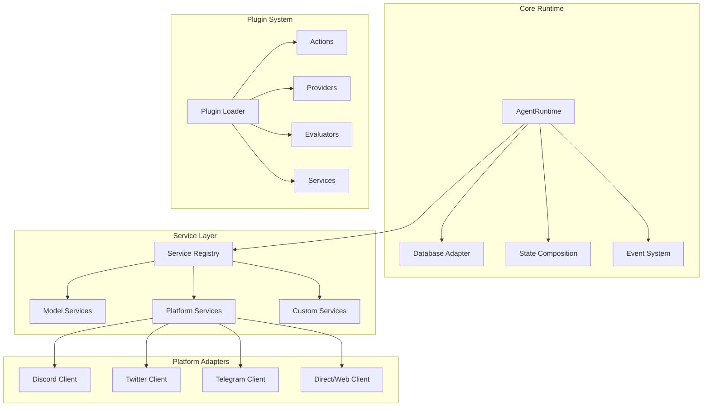
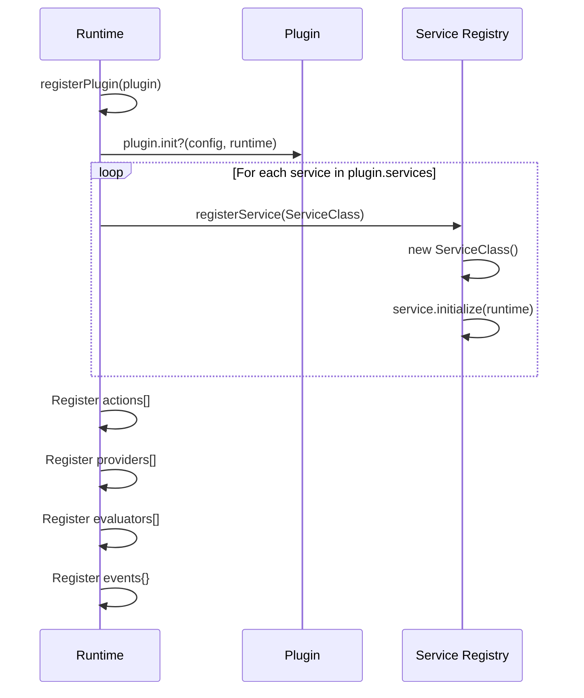
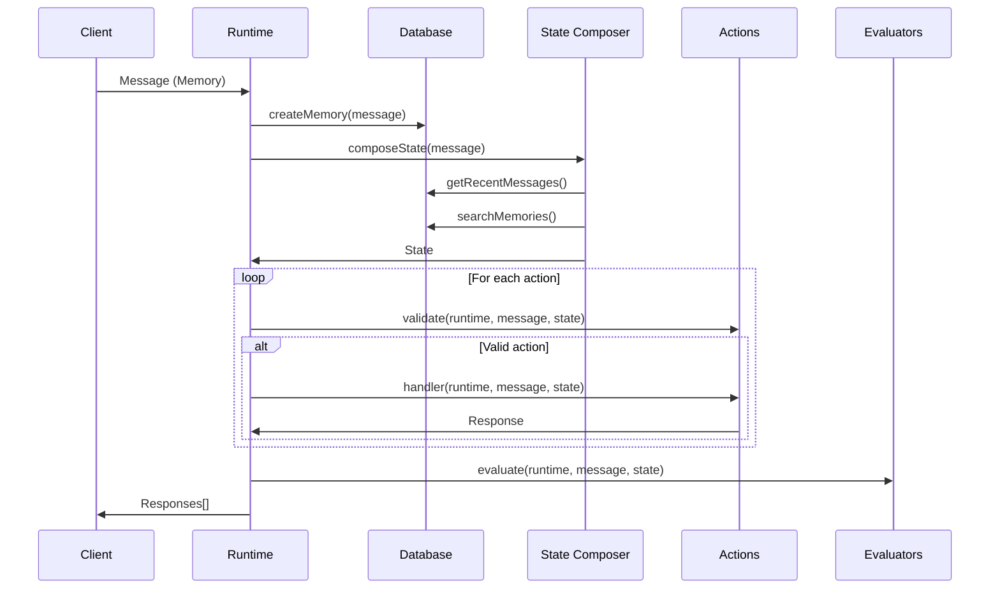
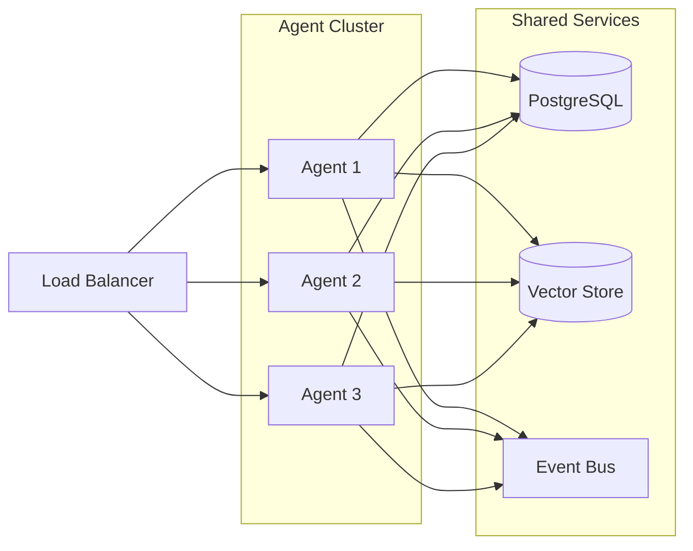

This document provides a comprehensive technical overview of the ElizaOS architecture, designed for
developers who want to understand the system's internals and build upon it.

## System Architecture

ElizaOS follows a modular, plugin-based architecture that enables flexible AI agent creation and
deployment across multiple platforms.



## Core Components

### Runtime Engine (`packages/core/src/runtime.ts`)

The heart of ElizaOS, responsible for:

- **Agent Lifecycle Management**: Starting, stopping, and managing agent instances
- **Message Processing Pipeline**: Routing messages through the plugin system
- **Context Assembly**: Building comprehensive context for AI interactions
- **Response Generation**: Orchestrating AI providers to generate responses

```typescript
class AgentRuntime implements IAgentRuntime {
  // Core properties
  readonly agentId: UUID;
  readonly character: Character;
  public adapter!: IDatabaseAdapter;
  
  // Plugin components (arrays, not maps)
  readonly actions: Action[] = [];
  readonly providers: Provider[] = [];
  readonly evaluators: Evaluator[] = [];
  readonly plugins: Plugin[] = [];
  
  // Service registry
  services = new Map<ServiceTypeName, Service>();
  
  // Event system
  events: Map<string, ((params: any) => Promise<void>)[]> = new Map();
  
  // State cache
  stateCache = new Map<UUID, {
    values: { [key: string]: any };
    data: { [key: string]: any };
    text: string;
  }>();
  
  // Core methods
  async processActions(
    message: Memory,
    responses: Memory[],
    state?: State,
    callback?: HandlerCallback
  ): Promise<void>;
  
  async composeState(message: Memory): Promise<State>;
}
```

### Memory System (`packages/core/src/memory.ts`)

Sophisticated memory management with multiple storage types:

#### Memory Types

1. **Short-term Memory**: Recent conversation context (last 10-20 messages)
2. **Long-term Memory**: Persistent facts and relationships
3. **Episodic Memory**: Specific conversation events and outcomes
4. **Semantic Memory**: Embeddings for similarity search

```typescript
// Memory operations are part of IAgentRuntime interface
interface IAgentRuntime extends IDatabaseAdapter {
  // Memory operations
  createMemory(memory: Memory, unique?: boolean): Promise<void>;
  
  getRecentMessagesInRoom(
    roomId: UUID,
    count?: number
  ): Promise<Memory[]>;
  
  searchMemoryByEmbedding(
    embedding: number[],
    params: {
      match_threshold?: number;
      count?: number;
      worldId?: UUID;
      table?: string;
    }
  ): Promise<Memory[]>;
  
  // Relationship operations
  getRelationship(
    userA: UUID,
    userB: UUID
  ): Promise<Relationship | null>;
  
  getRelationships(
    params: { entityId: UUID }
  ): Promise<Relationship[]>;
  
  createRelationship(
    params: {
      entityId1: UUID;
      entityId2: UUID;
      relationship: string;
    }
  ): Promise<boolean>;
}
```

### State Management

ElizaOS uses a hierarchical state system:

```typescript
// State interface from core
interface State {
  // Core data
  values: Record<string, any>;
  data?: any;
  text?: string;
  
  // Optional context arrays
  recentMessages?: Memory[];
  relevantKnowledge?: string[];
  relevantMemories?: Memory[];
  
  // Additional context
  context?: string;
  world?: UUID;
  mood?: string;
  agentId?: UUID;
  [key: string]: any; // Extensible
}
```

## Plugin Architecture

### Plugin Types

1. **Actions**: Discrete behaviors the agent can perform

   ```typescript
   interface Action {
     name: string;
     description: string;
     similes?: string[];
     examples?: ActionExample[][];
     validate: Validator;
     handler: Handler;
   }
   ```

2. **Providers**: Supply contextual information

   ```typescript
   interface Provider {
     name: string;
     description?: string;
     dynamic?: boolean;
     position?: number;
     private?: boolean;
     get: (
       runtime: IAgentRuntime,
       message: Memory,
       state: State
     ) => Promise<ProviderResult>;
   }
   ```

3. **Evaluators**: Post-processing and learning

   ```typescript
   interface Evaluator {
     name: string;
     description: string;
     similes?: string[];
     examples: EvaluationExample[];
     handler: Handler;
     validate: Validator;
     alwaysRun?: boolean;
   }
   ```

4. **Services**: Background services and integrations
   ```typescript
   interface Service {
     static serviceType: ServiceTypeName;
     initialize(runtime: IAgentRuntime): Promise<void>;
     start(): Promise<void>;
     stop(): Promise<void>;
   }
   ```

### Plugin Loading



## Platform Abstraction

### Room/Channel Abstraction

ElizaOS abstracts platform-specific concepts into a unified model:

```typescript
interface Room {
  id: UUID;
  entityIds: UUID[];
  worldId: UUID;
  source: string;
  name?: string;
  platformChannelId?: string;
  platformServerId?: string;
  description?: string;
  topic?: string;
  createdAt?: number;
}
```

### Message Normalization

All platform messages are normalized:

```typescript
// Memory is the core message type
interface Memory {
  id?: UUID;
  content: Content;
  entityId?: UUID;
  roomId?: UUID;
  worldId?: UUID;
  createdAt?: number;
  embedding?: number[];
  source?: string;
}

// Content structure
interface Content {
  text: string;
  source?: string;
  url?: string;
  inReplyTo?: UUID;
  attachments?: Media[];
  [key: string]: any;
}
```

## Request Flow

### Message Processing Pipeline



## Database Architecture

### Schema Design

ElizaOS uses a flexible schema that supports multiple database adapters:

```sql
-- Core tables
CREATE TABLE memories (
    id UUID PRIMARY KEY,
    type TEXT NOT NULL,
    world_id UUID NOT NULL,
    entity_id UUID NOT NULL,
    room_id UUID NOT NULL,
    source TEXT,
    content JSONB NOT NULL,
    embedding vector(1536),
    created_at BIGINT,
    metadata JSONB
);

CREATE TABLE relationships (
    id UUID PRIMARY KEY,
    entity_id1 UUID NOT NULL,
    entity_id2 UUID NOT NULL,
    world_id UUID NOT NULL,
    relationship TEXT NOT NULL,
    created_at BIGINT
);

CREATE TABLE entities (
    id UUID PRIMARY KEY,
    world_id UUID NOT NULL,
    name TEXT,
    source TEXT,
    created_at BIGINT,
    updated_at BIGINT,
    metadata JSONB
);

CREATE TABLE rooms (
    id UUID PRIMARY KEY,
    world_id UUID NOT NULL,
    name TEXT,
    source TEXT,
    created_at BIGINT,
    metadata JSONB
);
```

### Database Adapters

- **PostgreSQL**: Full-featured with pgvector extension for embeddings
- **SQLite**: Lightweight for development (via plugin-sql)
- **In-Memory**: Testing and ephemeral agents
- **Custom Adapters**: Implement IDatabaseAdapter interface

## Performance Considerations

### Caching Strategy

```typescript
class CacheManager {
  // Multi-level cache
  l1Cache: LRUCache<string, any>; // In-process cache
  l2Cache: RedisCache; // Distributed cache

  // Cache invalidation
  invalidatePattern(pattern: string): Promise<void>;

  // Smart caching
  cacheWithTTL(key: string, value: any, ttl: number): Promise<void>;
}
```

### Concurrency Model

- **Message Processing**: Concurrent per room, sequential per user
- **Memory Operations**: Read-heavy optimization with write batching
- **AI Calls**: Request pooling and rate limiting
- **Plugin Execution**: Isolated execution contexts

## Security Architecture

### Authentication & Authorization

```typescript
interface SecurityContext {
  // User authentication
  userId: UUID;
  permissions: Permission[];

  // Platform verification
  platformId: string;
  platformVerified: boolean;

  // Rate limiting
  rateLimitBucket: string;
  requestCount: number;
}
```

### Plugin Sandboxing

- Plugins run in isolated contexts
- Resource usage limits enforced
- API access controlled by permissions
- No direct database access

## Monitoring & Observability

### Metrics Collection

```typescript
interface Metrics {
  // Performance metrics
  messageProcessingTime: Histogram;
  aiResponseTime: Histogram;
  memoryOperationTime: Histogram;

  // Business metrics
  messagesProcessed: Counter;
  activeUsers: Gauge;
  pluginExecutions: Counter;

  // Error tracking
  errors: Counter;
  aiFailures: Counter;
}
```

### Logging Architecture

- Structured logging with correlation IDs
- Log levels: `trace`, `debug`, `info`, `warn`, `error`, `fatal`
- Automatic PII redaction
- Log aggregation support

## Deployment Architecture

### Horizontal Scaling



### High Availability

- Stateless agent instances
- Shared state in database/cache
- Automatic failover
- Health checks and self-healing

## Development Patterns

### Service Pattern

```typescript
abstract class BaseService implements IService {
  protected runtime: AgentRuntime;

  abstract initialize(): Promise<void>;
  abstract shutdown(): Promise<void>;

  // Service discovery
  getService<T extends IService>(name: string): T {
    return this.runtime.getService<T>(name);
  }
}
```

### Event-Driven Architecture

```typescript
// Event emitter pattern
runtime.on("message:received", async (message) => {
  await processMessage(message);
});

runtime.on("memory:created", async (memory) => {
  await indexMemory(memory);
});

runtime.on("goal:completed", async (goal) => {
  await evaluateGoal(goal);
});
```

## Further Reading

- [Core Concepts Deep Dive](./core-concepts)
- [Plugin Development Guide](../development/plugin-development)
- [State Management Details](./state-management)
- [API Reference](../api-reference/core-api)
