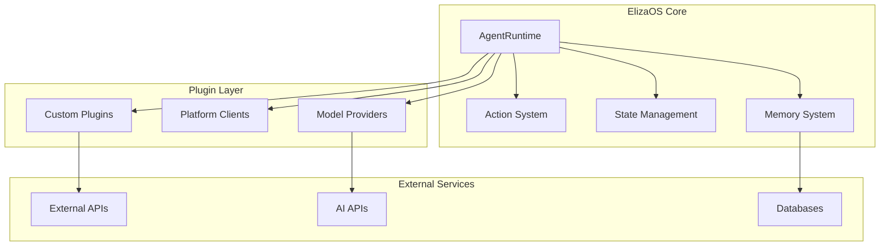

Welcome to the Technical Learning Track for ElizaOS - your comprehensive guide to building production-ready AI agent systems.

## What You'll Build

By completing this track, you'll be able to create:

- **Autonomous AI Agents** that can reason, plan, and execute complex tasks
- **Custom Plugins** extending ElizaOS with new capabilities
- **Multi-Agent Systems** where agents collaborate and coordinate
- **Production Deployments** handling thousands of concurrent users
- **Advanced Integrations** with external APIs, blockchains, and services

## Who This Track Is For

### Perfect For

- **Full-Stack Developers** wanting to add AI capabilities to applications
- **Backend Engineers** building scalable AI infrastructure
- **DevOps Engineers** deploying and monitoring agent systems
- **AI Researchers** experimenting with agent architectures
- **Technical Founders** building AI-powered products

### Prerequisites

**Required Knowledge:**
- **TypeScript/JavaScript**: Comfortable with ES6+, async/await, modules
- **Node.js**: Understanding of event loop, npm/bun, package management
- **Git**: Version control, branching, pull requests
- **APIs**: REST, WebSockets, authentication patterns

**Helpful but Not Required:**
- Docker and containerization
- Database design (PostgreSQL)
- AI/ML fundamentals
- Cloud deployment (AWS/GCP/Azure)

## Technical Architecture Overview



## Core Technical Concepts

### 1. Agent Runtime

The `AgentRuntime` is the heart of ElizaOS - an orchestration system that:

```typescript
// Core runtime responsibilities
class AgentRuntime {
  // Manages agent lifecycle
  async initialize(): Promise<void>
  
  // Processes incoming messages
  async processMessage(message: Memory): Promise<Response>
  
  // Manages state and memory
  async composeState(message: Memory): Promise<State>
  
  // Coordinates actions
  async evaluateActions(state: State): Promise<Action[]>
  
  // Handles service registration
  registerService(service: Service): void
}
```

**Key Concepts:**
- **Event-driven architecture** for scalability
- **Plugin-based extensibility** for modularity
- **State composition** for context awareness
- **Action evaluation** for decision making

### 2. Memory System

ElizaOS implements a sophisticated memory architecture:

```typescript
interface MemorySystem {
  // Short-term memory (conversation context)
  conversationMemory: Memory[]
  
  // Long-term memory (persistent storage)
  longTermMemory: MemoryStore
  
  // Semantic memory (knowledge base)
  knowledgeBase: KnowledgeStore
  
  // Working memory (current state)
  workingMemory: State
}
```

**Memory Types:**
- **Conversational**: Recent messages and context
- **Episodic**: Specific events and interactions
- **Semantic**: Facts and knowledge
- **Procedural**: How to perform tasks

### 3. Plugin Architecture

Plugins extend ElizaOS capabilities:

```typescript
interface Plugin {
  name: string
  description: string
  
  // Optional components
  actions?: Action[]
  evaluators?: Evaluator[]
  providers?: Provider[]
  services?: Service[]
  
  // Lifecycle hooks
  onInitialize?: (runtime: IAgentRuntime) => Promise<void>
  onMessage?: (message: Memory) => Promise<void>
}
```

**Plugin Categories:**
- **Model Providers**: AI model integrations (OpenAI, Claude, Ollama)
- **Platform Clients**: Social platforms (Discord, Twitter, Telegram)
- **Service Integrations**: External APIs and services
- **Custom Logic**: Domain-specific functionality

### 4. Action System

Actions are the "muscles" of your agent:

```typescript
interface Action {
  name: string
  description: string
  
  // Validation logic
  validate: (runtime: IAgentRuntime, message: Memory) => Promise<boolean>
  
  // Execution logic
  handler: (runtime: IAgentRuntime, message: Memory) => Promise<Response>
  
  // Optional examples for better AI understanding
  examples?: Example[]
}
```

**Action Types:**
- **Response Actions**: Generate replies
- **Tool Actions**: Use external tools
- **State Actions**: Modify agent state
- **Integration Actions**: Interact with services

## Track Curriculum

### Phase 1: Foundation (Week 1)

#### Day 1-2: Architecture Deep Dive
- Understanding the runtime lifecycle
- Plugin system architecture
- Memory and state management
- Event-driven patterns

#### Day 3-4: Development Environment
- Setting up TypeScript development
- Debugging ElizaOS agents
- Testing strategies
- Performance profiling

#### Day 5-7: First Custom Plugin
- Plugin structure and lifecycle
- Creating custom actions
- Adding evaluators and providers
- Testing and deployment

### Phase 2: Advanced Development (Week 2)

#### Day 8-9: Memory Systems
- Implementing custom memory stores
- Vector databases for semantic search
- Knowledge graph integration
- Memory optimization techniques

#### Day 10-11: Multi-Agent Systems
- Agent communication protocols
- Shared state management
- Coordination patterns
- Consensus mechanisms

#### Day 12-14: Production Systems
- Scaling strategies
- Error handling and recovery
- Monitoring and observability
- Security best practices

### Phase 3: Specialization (Week 3)

Choose your specialization path:

#### Path A: Platform Integration
- Building custom clients
- WebSocket management
- API rate limiting
- Platform-specific features

#### Path B: AI/ML Enhancement
- Custom model providers
- Fine-tuning strategies
- Prompt engineering
- RAG implementation

#### Path C: Infrastructure
- Kubernetes deployment
- Auto-scaling agents
- Distributed systems
- High availability

## Development Best Practices

### Code Organization

```typescript
// Recommended project structure
my-elizaos-project/
├── src/
│   ├── plugins/           // Custom plugins
│   │   ├── my-plugin/
│   │   │   ├── index.ts
│   │   │   ├── actions/
│   │   │   ├── providers/
│   │   │   └── tests/
│   ├── agents/           // Agent configurations
│   ├── lib/              // Shared utilities
│   └── types/            // TypeScript definitions
├── tests/                // Test suites
├── scripts/              // Build and deploy scripts
└── docs/                 // Documentation
```

### TypeScript Patterns

```typescript
// Use strict typing for safety
import { IAgentRuntime, Memory, State } from '@elizaos/core';

// Define clear interfaces
interface MyCustomAction extends Action {
  customProperty: string;
  
  // Use generics for flexibility
  process<T extends Memory>(input: T): Promise<ProcessedResult>;
}

// Leverage type guards
function isValidMemory(obj: unknown): obj is Memory {
  return obj !== null && 
         typeof obj === 'object' && 
         'content' in obj;
}
```

### Testing Strategy

```typescript
// Unit tests for individual components
describe('CustomAction', () => {
  it('should validate correct messages', async () => {
    const result = await action.validate(runtime, message);
    expect(result).toBe(true);
  });
});

// Integration tests for plugins
describe('MyPlugin', () => {
  it('should register with runtime', async () => {
    const runtime = new AgentRuntime(config);
    await runtime.registerPlugin(myPlugin);
    expect(runtime.plugins).toContain(myPlugin);
  });
});

// E2E tests for complete flows
describe('Agent Conversation', () => {
  it('should handle multi-turn dialogue', async () => {
    const agent = await createAgent(config);
    const response = await agent.chat('Hello');
    expect(response).toMatchSnapshot();
  });
});
```

## Performance Optimization

### Key Metrics

- **Response Time**: < 500ms for simple queries
- **Throughput**: 100+ concurrent conversations
- **Memory Usage**: < 500MB per agent instance
- **Token Efficiency**: Optimize context windows

### Optimization Techniques

```typescript
// 1. Efficient state composition
async function composeState(message: Memory): Promise<State> {
  // Parallel data fetching
  const [memories, knowledge, context] = await Promise.all([
    this.searchMemories(message),
    this.searchKnowledge(message),
    this.getRecentContext()
  ]);
  
  // Selective inclusion based on relevance
  return {
    relevantMemories: memories.slice(0, 5),
    knowledge: knowledge.slice(0, 3),
    recentMessages: context.slice(0, 10)
  };
}

// 2. Caching strategies
const cache = new LRUCache<string, EmbeddingVector>({
  max: 1000,
  ttl: 1000 * 60 * 60 // 1 hour
});

// 3. Connection pooling
const dbPool = new Pool({
  max: 20,
  idleTimeoutMillis: 30000,
  connectionTimeoutMillis: 2000,
});
```

## Security Considerations

### Authentication & Authorization

```typescript
// Implement API key validation
middleware.authenticate = async (req, res, next) => {
  const apiKey = req.headers['x-api-key'];
  
  if (!apiKey || !await validateApiKey(apiKey)) {
    return res.status(401).json({ error: 'Unauthorized' });
  }
  
  next();
};

// Role-based access control
const checkPermission = (action: string) => {
  return async (runtime: IAgentRuntime, message: Memory) => {
    const user = await runtime.getUser(message.userId);
    return user.permissions.includes(action);
  };
};
```

### Data Protection

- **Encryption at rest** for sensitive data
- **Input sanitization** to prevent injection
- **Rate limiting** to prevent abuse
- **Audit logging** for compliance

## Contributing to ElizaOS

### Getting Involved

1. **Start Small**: Fix documentation, add tests
2. **Build Plugins**: Share your creations
3. **Report Issues**: Help improve the framework
4. **Join Discussions**: Share your expertise

### Contribution Workflow

```bash
# Fork and clone
git clone https://github.com/yourusername/eliza.git
cd eliza

# Create feature branch
git checkout -b feature/my-awesome-feature

# Make changes and test
bun test
bun run lint

# Submit PR with clear description
```

## Resources & Support

### Documentation
- **API Reference**: Detailed method documentation
- **Architecture Guides**: System design patterns
- **Example Code**: Working implementations
- **Video Tutorials**: Visual learning resources

### Community
- **Discord**: #technical-discussion channel
- **GitHub Discussions**: Architecture decisions
- **Weekly Office Hours**: Live Q&A sessions
- **Code Reviews**: Learn from experts

## Your Learning Journey

### Week 1 Goals
- [ ] Set up development environment
- [ ] Understand core architecture
- [ ] Build your first plugin
- [ ] Deploy a basic agent

### Week 2 Goals
- [ ] Implement custom memory system
- [ ] Create multi-agent communication
- [ ] Add comprehensive tests
- [ ] Optimize performance

### Week 3 Goals
- [ ] Choose specialization path
- [ ] Build production system
- [ ] Contribute to open source
- [ ] Share your learnings

## Ready to Begin?

Start your journey with the [Architecture Overview](./architecture/) to understand how ElizaOS works under the hood. Then move to [Development Setup](./development/) to prepare your environment.

Remember: The best way to learn is by building. Start with simple plugins and gradually increase complexity as you understand the system better.

---

**Estimated completion time**: 40-60 hours of focused learning  
**Difficulty**: Advanced  
**Outcome**: Production-ready AI agent development skills

<Callout type="success">
Welcome to the future of AI development. Let's build something amazing together!
</Callout>